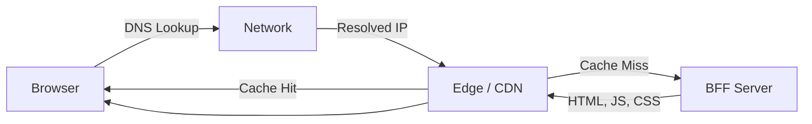
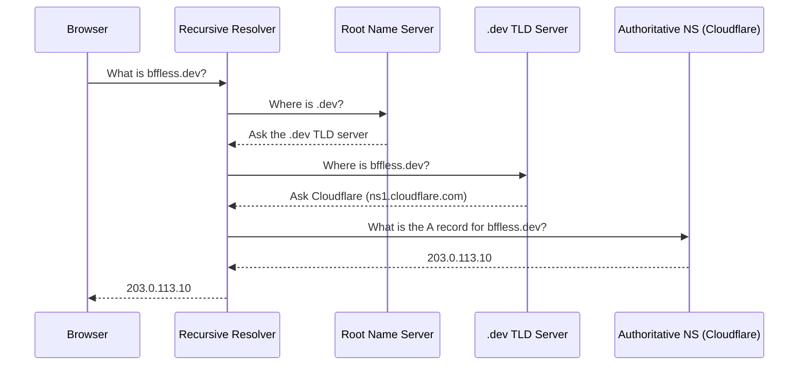
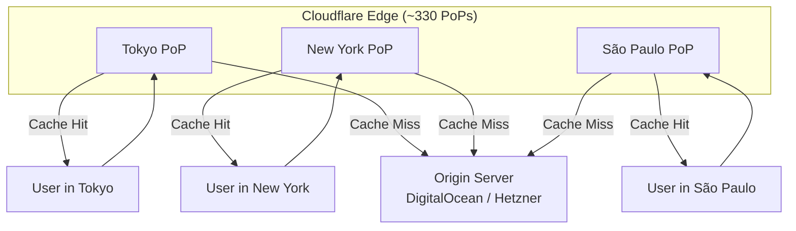
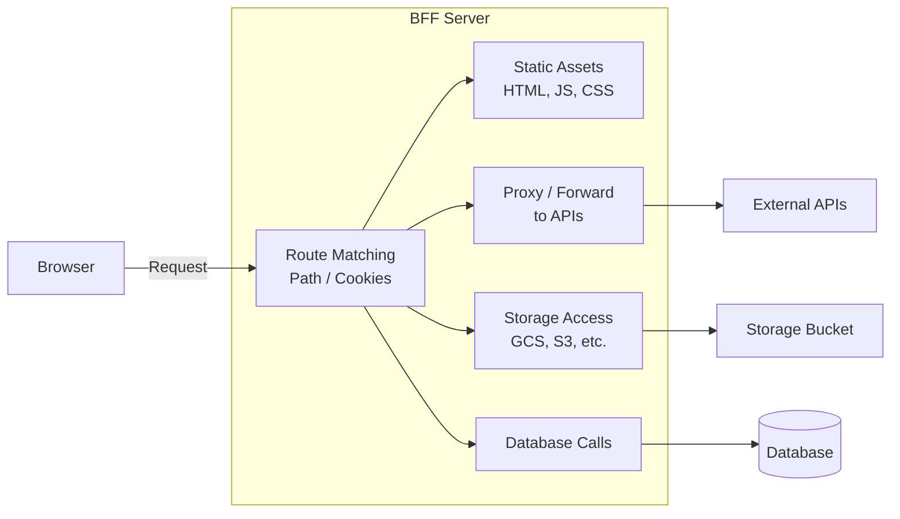
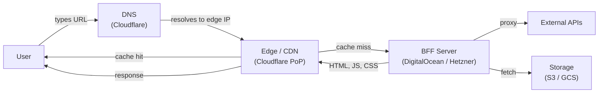

Every time you type a URL into your browser and press Enter, a remarkable chain of events unfolds in milliseconds. Your request travels through layers of infrastructure — a network that finds the right server, an edge that protects and accelerates the response, and finally a server that assembles the content you see on screen. This post breaks down each of those layers in detail, explaining how [BFFless](https://bffless.dev/) — a Backend-For-Frontend platform — fits into the picture when deployed on cloud providers like DigitalOcean or Hetzner and served through Cloudflare.

<YouTubeEmbed id="luQMEUYzsUQ" title="Web Architecture Explained: DNS, The Edge, and BFF Servers" />

<!-- truncate -->

## A Brief History of Communication

Before we dive into the technical layers, it helps to appreciate how we got here. Human communication started with the simplest possible protocol: yelling across a distance. No latency optimization, no caching — just raw vocal output and the hope that someone was within earshot.

The telephone changed everything. Suddenly you had a structured system: a caller, wires carrying the signal, an exchange that routed the call, and a callee on the other end. The internet, when it arrived, borrowed heavily from this model. Instead of a caller and callee, we have a browser and a server. Instead of a telephone exchange, we have routers and DNS servers. Instead of copper wires, we have fiber optics and undersea cables spanning oceans.

The modern web request passes through three conceptual layers that mirror this evolution:

1. **The Network** — how the browser discovers *where* to send the request
2. **The Edge** — what sits in front of the server to protect and accelerate it
3. **The Server (BFF)** — where the request finally lands and content is assembled

## The Network: How the Request Finds the Server

At its core, the network layer exists for one purpose: to map a human-readable domain name — like `bffless.dev` — to the IP address of a server somewhere in the world. This process is called **DNS resolution** (Domain Name System), and while the full mechanics are intricate, the essential flow is straightforward.

### Domain Registration and Name Servers

It all starts when you register a domain name with a **domain name registrar**. The registrar doesn't host your website — it simply records which **name servers** are authoritative for your domain. When you point your domain to Cloudflare's name servers, for example, you're telling the global DNS infrastructure: "Cloudflare knows where this domain lives."

Cloudflare then holds your **DNS records** — the actual mappings between your domain and IP addresses. The most common record type is an **A record**, which maps a domain directly to an IPv4 address. There are also **AAAA records** for IPv6, **CNAME records** that alias one domain to another, **MX records** for email routing, and many more. Cloudflare supports over eight record types, each serving a different purpose.

### How DNS Resolution Actually Works

When your browser needs to resolve a domain, it doesn't go straight to the authoritative name server. Instead, the request walks through a hierarchy:

1. **The browser** checks its local cache first. If it recently resolved this domain, it already knows the answer.
2. **The recursive resolver** (typically provided by your ISP, or a public resolver like `1.1.1.1` or `8.8.8.8`) takes over if the cache is empty. It asks the root name servers.
3. **The root name servers** (there are 13 logical root server clusters worldwide) don't know specific domains, but they know which servers handle each top-level domain (`.com`, `.org`, `.io`, etc.).
4. **The TLD name server** for `.dev` knows which authoritative name servers are responsible for `bffless.dev`.
5. **The authoritative name server** — in this case, Cloudflare — returns the actual IP address from the DNS records you configured.

This recursive walk happens in milliseconds, and the result is cached at every level based on the **TTL** (Time To Live) value you set on each record. A TTL of 300 seconds means resolvers will cache the answer for five minutes before asking again. Shorter TTLs give you faster propagation when you change records; longer TTLs reduce DNS query load.

### Why This Matters

The critical insight is that **you control the DNS records**. Your name server and DNS configuration determine where traffic goes. You can point your domain to DigitalOcean, Hetzner, Google Cloud, Amazon — wherever you choose. If you decide to migrate your backend to a different cloud provider, you simply update the DNS record to point to the new IP address. No changes to your domain registration are needed. This separation of concerns — registrar from name server from hosting — is one of the most powerful aspects of the internet's architecture.

Cloudflare's authoritative DNS runs on approximately **330 anycast Points of Presence (PoPs)** around the world, which means DNS queries are answered from the nearest location, keeping resolution times low.

## The Edge: What Sits in Front of the Server

Once the network has resolved the domain to an IP address, the request reaches the **edge**. The edge is the layer that sits between the user and your origin server. It has three primary responsibilities:

1. **Serving cached content** so the origin server doesn't have to
2. **Blocking malicious traffic** from bad actors
3. **Forwarding legitimate requests** to the backend when needed

### How Anycast and Points of Presence Work

Edge providers like [Cloudflare](/getting-started/cloudflare-setup/) operate hundreds of PoPs distributed across the globe. When a user in Tokyo makes a request, it lands at a Cloudflare server in or near Tokyo. When a user in New York makes the same request, it lands at a PoP in New York. This is achieved through **anycast routing** — a networking technique where the same IP address is announced from multiple physical locations, and the internet's routing protocols naturally direct traffic to the nearest one.

This design has several powerful implications:

- **Latency under 30ms** for the initial connection in most of the world
- **The origin server's real IP is hidden** — DNS resolves to Cloudflare's anycast IPs, not your server's actual address, making it much harder for attackers to target your infrastructure directly
- **The origin is rarely touched** for cacheable content, reducing load and cost

### Inside the Edge: The Request Pipeline

Every request that arrives at the edge flows through a pipeline of security and performance stages before it ever reaches your origin server. The Cloudflare edge pipeline includes these key stages:

- **DDoS Protection** — The first gate. Cloudflare absorbs volumetric attacks (floods of traffic designed to overwhelm your server) at the network edge. Layer 3/4 attacks are mitigated automatically before they consume any of your resources. This includes SYN floods, UDP amplification attacks, and other protocol-level abuse.

- **TLS Termination** — The edge terminates the HTTPS connection, decrypting the request so it can be inspected and routed. This means your origin server doesn't need to handle the computational overhead of TLS handshakes for every visitor. Cloudflare manages certificate issuance and renewal automatically.

- **WAF (Web Application Firewall)** — Pattern inspection on the decrypted request. The WAF examines headers, query parameters, request bodies, and cookies against known attack signatures — SQL injection, cross-site scripting (XSS), path traversal, and more. Cloudflare's managed rulesets are updated continuously as new threats emerge.

- **CDN Cache** — The headline win. If the requested resource (an HTML page, a JavaScript bundle, an image) is already cached at this PoP, it's returned immediately without ever contacting your origin. Cache hit ratios of 80–95% are common for static assets, meaning your server handles only a fraction of actual traffic.

This layered approach means that by the time a request reaches your BFF server, it has already been filtered as legitimate, decrypted, inspected for threats, and checked against the cache. Your server only deals with the requests that genuinely need fresh computation.

## The Server: The Backend For Frontend

The final stop in the request's journey is the **server** — specifically, a **Backend For Frontend** (BFF). This is the application that actually assembles and returns the response.

### What Makes a BFF Different from a Generic API?

The term "Backend For Frontend" is intentional. A BFF is **not** a general-purpose API designed to serve any client. It is a server **tailored to one frontend's needs**. The distinction matters:

- A **generic API** exposes data endpoints (`/users`, `/products`, `/orders`) that any client — mobile app, third-party integration, internal tool — can consume. It's designed for maximum flexibility.
- A **BFF** sits closer to the frontend. Its primary job is returning **HTML, JavaScript, and CSS** — the assets the web browser needs to render a page. It understands the specific frontend it serves and can optimize responses accordingly.

But a BFF can do much more than serve static files. It also has the capability to:

- **Forward requests to other APIs** — acting as a [proxy](/features/proxy-rules/) so the frontend never needs to know about backend service URLs, avoiding CORS issues entirely
- **Make database calls** — fetching or mutating data as needed for the page
- **Pull content from storage buckets** — retrieving assets from [GCS, Amazon S3](/storage/overview/), or any other cloud storage provider
- **Route based on URL path or cookies** — serving different content based on the request context, enabling patterns like [A/B testing](/blog/ab-testing-landing-pages/) or personalized experiences

### BFF in Practice with BFFless

With [BFFless](https://bffless.dev/), the BFF pattern becomes concrete. You might build a presentation using Reveal.js, a site with React or Astro, or any other frontend framework. You upload it to your BFFless backend, and it handles serving that content to the browser — complete with the edge protection and DNS configuration described above.

The architecture looks like this when all the pieces come together:

The BFF server is [deployed](/deployment/overview/) on your cloud provider of choice — DigitalOcean, Hetzner, or others. Cloudflare sits in front as both the DNS authority and the edge network. The browser never communicates directly with your origin server; every request flows through Cloudflare's edge first, gaining the benefits of caching, DDoS protection, WAF filtering, and TLS termination.

## Wrapping Up

The modern web request is a relay race through three distinct layers:

1. **The Network** resolves your domain name to an IP address through a hierarchical DNS lookup that cascades from root servers to TLD servers to your authoritative name server.
2. **The Edge** intercepts the request at the nearest point of presence, checks it against DDoS filters and WAF rules, serves it from cache if possible, and only forwards cache misses to your origin.
3. **The BFF Server** receives the cleaned, validated request and returns the HTML, JavaScript, and CSS your browser needs — or proxies the request onward to APIs and storage services.

Each layer has a clear responsibility, and each can be configured and scaled independently. By understanding how these pieces fit together, you gain the ability to make informed decisions about where to host, how to protect, and how to accelerate your web applications. Whether you're deploying a simple static site or a complex frontend application, this architecture — DNS to edge to BFF — is the foundation everything runs on.
