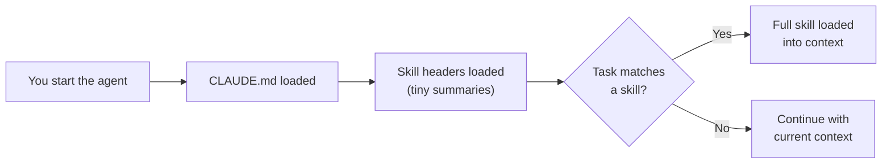
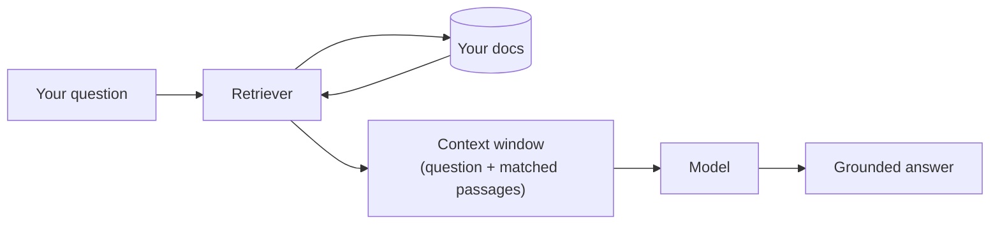
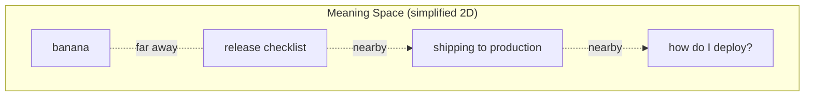
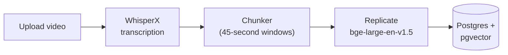
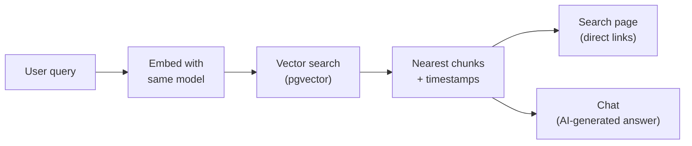
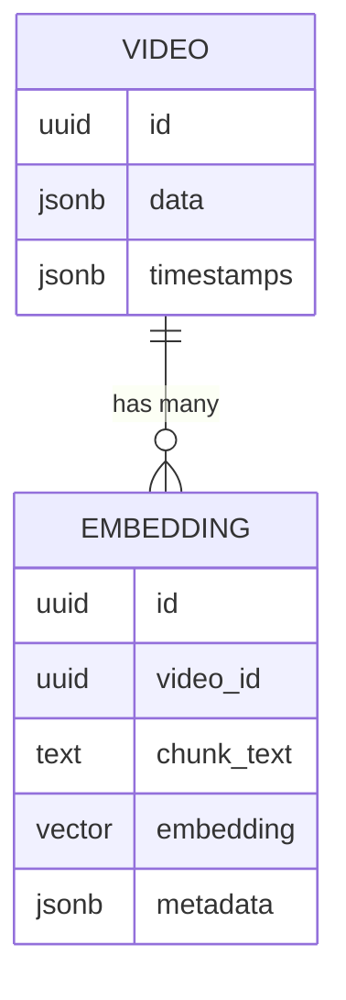

Terms like *RAG* and *vector database* get thrown around constantly in AI conversations, but what do they actually mean? This post is a technical deep dive into both concepts. We will start with the fundamentals — what an AI model actually knows and why that matters — then work through how vector search operates under the hood, and finally see it all running in a real application called [Recall](/blog/walkthrough-of-recall-a-custom-rag-video-search-app/), built entirely with [BFFless pipelines](/features/pipelines/).

<YouTubeEmbed id="0jJ6WxwurgM" title="Vector Databases and RAG Explained: Video Search Demo" />

<!-- truncate -->

## What a Model Actually Knows: The Context Window

A large language model like Claude or ChatGPT is trained once on a massive snapshot of text. Training can cost millions or even billions of dollars, and the result is essentially a frozen file. At runtime the model does exactly one thing: it predicts the next word from whatever input it can see. It has no memory of you, your company, or anything that happened after training day. You could run it locally on your computer with no internet connection — feed it input, get output.

The **context window** is everything the model can see right now: your messages, your instructions, files you attach, tool results — all of it. But it is a *finite budget*, not a hard drive. Current context windows max out at roughly a million tokens, and if something is not in that window the model simply does not know about it.

Coding agents like Claude Code illustrate this well. When you start an agent from a project directory, the first thing it does is read files like `CLAUDE.md` or `agents.md` and add them to the context window. You can also place files in a special `skills/` directory. Each skill file has a small header summarising what it covers, so only that tiny summary is loaded initially. Later, if the agent encounters a task that matches a skill, it loads the full file on demand — essentially *lazy loading* content into the context window.

As the conversation continues — more files, more images, more messages — the context window grows. The problem is obvious: you may have a mountain of information the agent needs access to, but it simply cannot all fit at once.

## What Is RAG?

This is where **RAG** — *Retrieval-Augmented Generation* — comes in. Rather than trying to cram everything into the context window up front, RAG gives the model something like a library card to your own custom library of information.

The analogy works well: imagine you need to research how vectors work. You do not memorise every book in the library. Instead you walk in, look up a book on vectors, read the relevant chapter, and become an expert in that one area for the task at hand. The millions of other books stay on the shelf, untouched.

The **RAG loop** works the same way:

1. You ask a question.
2. A *retriever* searches your document library and pulls back the most relevant passages.
3. Those passages, together with your question, are placed into the context window.
4. The model generates an answer grounded in what it just read.

Because the model's answer is grounded in the retrieved content, it can speak accurately about *your* data — documentation, transcripts, internal wikis — without that information ever having been part of its original training.

## How Vector Search Works

The next question is: how does the retriever *find* the right passages? Keyword search is not enough. Keywords find words, not meaning. Searching for "car" misses documents that say "automobile"; searching for "how do I deploy" misses a page titled "shipping to production." A good library catalog needs to understand what a book is *about*, not just which words appear in it.

### The Latitude-Longitude Analogy

A powerful analogy is geolocation. When you search Google for "restaurants near me," Google knows your position as a latitude and longitude, and it has every restaurant indexed with its own latitude and longitude. The search is really just: *find all the points closest to my point on the map*.

**Embeddings** are latitude and longitude *for concepts*. It is the same trick as the map, but with many more dimensions. An embedding model converts a chunk of text into a large array of numbers — a *vector* — that places that text at a specific location in a high-dimensional meaning space. Texts with similar meaning end up near each other on this map, even if they share no words at all.

So "release checklist," "shipping to production," and "how do I deploy" all cluster together on the map, while unrelated concepts like "banana" sit far away. No shared words are needed — the search finds meaning, not keywords.

### The Three Steps of Vector Search

1. **Ahead of time:** embed every chunk of every document into vectors and store them.
2. **At question time:** embed the question with the *same* model.
3. **Find the nearest stored vectors** — those chunks are your answer.

"Nearest" here is typically cosine similarity, the same family of math as distance on a map.

## How BFFless Does It: The Recall App

All of these concepts come together in an application called **Recall** — we covered its features in a [previous walkthrough](/blog/walkthrough-of-recall-a-custom-rag-video-search-app/). Recall is a video search tool: after a video is created, it is uploaded to an admin section where the audio is transcribed and the transcript is embedded into a vector database. The public site lets users search across those videos, with answers that deep-link to the exact second of the video. There is no traditional app server — everything runs through [BFFless pipelines](/features/pipelines/).

### Ingestion Pipeline

The ingestion process has three staged steps:

1. **Upload** — the video file is stored in a bucket.
2. **Transcribe** — WhisperX processes the audio and produces word-level timestamps, so the system knows the exact second every word is spoken.
3. **Publish & Index** — the transcript is chunked into 45-second windows, each chunk is sent to Replicate for embedding, and the resulting vectors are stored in the database.

Each chunk is sent to Replicate, which runs the `bge-large-en-v1.5` embedding model. The result is a **1,024-dimensional vector** per chunk — far richer than a two-dimensional latitude/longitude pair. Those vectors are stored in Postgres using the **pgvector** extension, which turns the existing database into a vector DB.

### Asking a Question

When a user types a search query on the public site, the same embedding model converts the query into a 1,024-dimensional vector. A vector search is run against the pgvector database to find the nearest chunks. Those chunks — each mapped to roughly 45 seconds of video — are returned as search results with deep links. Users can also interact through a [chat](/features/chat/) interface, where the retrieved chunks are fed into an AI model that generates a conversational answer with timestamped links.

## Live Demo: Search and Chat

In the demo, a development instance of Recall has one video stored — a walkthrough of an AI video editing app called [Studio](/blog/walkthrough-of-the-studio-ai-video-editing-app/). Searching for *"how do I create a thumbnail for the video"* triggers the full RAG loop: the query is sent to Replicate for embedding, the vector search runs against Postgres, and matching chunks are returned.

Switching over to Replicate's dashboard during the search reveals the embedding in progress. When the model is "cold" (not recently used), the API call can take around 30 seconds; when "warm," it completes in seconds. The output is a large array of numbers — the vector representation of the query.

Back on the Recall search page, the results appear as clickable segments that jump directly to the relevant moment in the video. Users can also switch to the chat interface, which works similarly to ChatGPT or Claude — the AI reads the retrieved chunks and generates a natural-language answer with links to specific timestamps.

The demo also shows an honest limitation: using a smaller, less capable model (Haiku) for the chat sometimes returns confused or off-target answers. After a few rounds of refinement — narrowing the question to specifically ask about generating thumbnail cover images on the export page — the chat produces a solid answer. A more capable model would have required less back-and-forth.

## Under the Hood: The Database

For the technically curious, the final section explores what the data actually looks like at the database level.

In the BFFless admin interface, each video's data is visible as a JSON blob containing words, timestamps, and metadata — but *not* the embeddings themselves. Navigating to the actual Postgres database reveals two related structures:

- **The video row** — contains the JSON data (transcript text, timestamps, metadata).
- **The embeddings table** — a joined table where each row holds a chunk of text, its timestamp metadata, and its 1,024-dimensional embedding vector.

When a search is performed, the query is embedded into a vector, and pgvector finds the closest matching row in this embeddings table. The matched chunk text and its timestamps are returned to the user. It is a straightforward join: the vector DB finds the nearest embedding, which maps back to a chunk, which maps back to a moment in the video.

## Key Takeaways

The core concept tying everything together is **lazy loading**. You cannot feed an AI model everything at once, and you do not want to — you only want to give it the information it needs for the task at hand.

- **A model only knows what is in its context window.** Everything else is invisible.
- **RAG is the library.** Instead of memorising everything, the model searches for what it needs and pulls it into context on demand.
- **Vector search is how that search works.** Embeddings turn text into coordinates in a meaning space, and "nearest neighbor" search finds the most relevant content — even without shared keywords.
- **Recall is the implementation.** Transcripts are chunked, embedded with `bge-large-en-v1.5`, stored in Postgres with pgvector, and searched at query time to deliver second-exact answers from video content — all powered by [BFFless pipelines](/features/pipelines/) with no app server.

Latitude and longitude for restaurants. Embeddings for concepts. Same math, same idea, far more dimensions.
