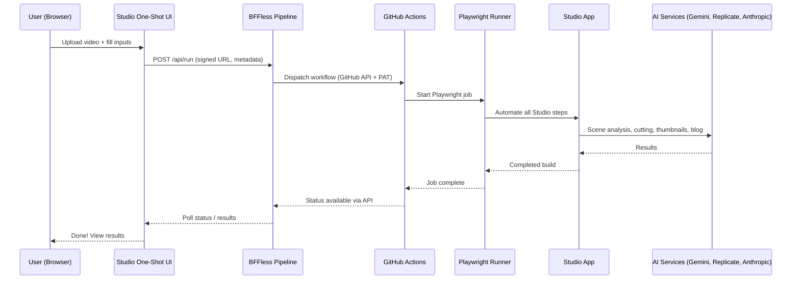
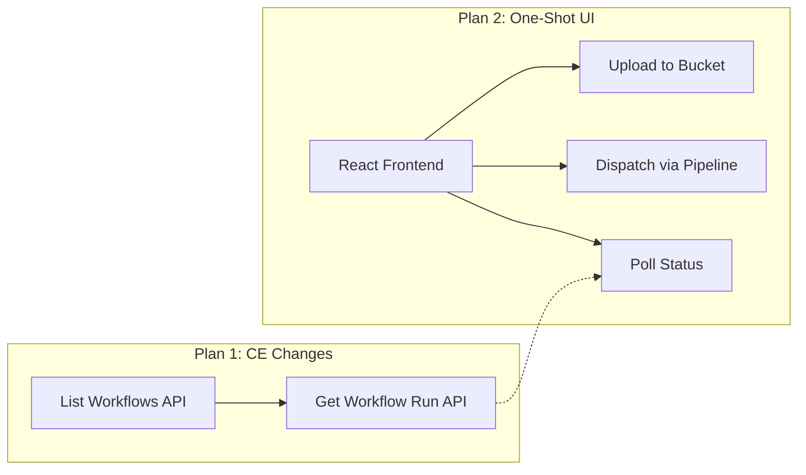
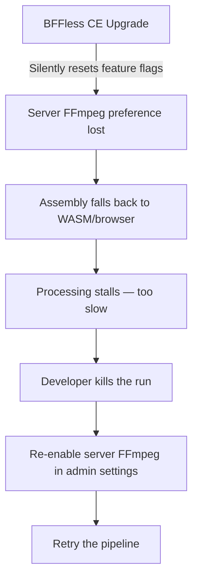
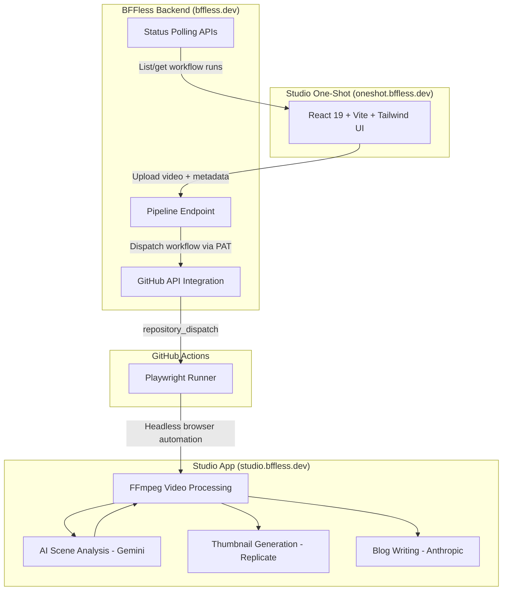

What if you could upload a raw video, fill in a few fields, click **Submit**, and walk away — returning later to a fully edited video, a generated blog post, and an AI-created thumbnail? That is exactly the goal of this session: vibe-coding a hands-free, one-shot video post-production pipeline using Claude, [BFFless](https://bffless.dev/), and [GitHub Actions](/deployment/github-actions/).

The existing [Studio app](/blog/walkthrough-of-the-studio-ai-video-editing-app/) already handles AI-driven video editing, but it requires a human to sit at the UI and walk through each step. There is an auto-build mode that runs in the browser, but you still have to be present. The breakthrough here is a headless runner — a Playwright-based GitHub Actions workflow that drives Studio programmatically. All that is missing is a simple frontend to kick it off.

<YouTubeEmbed id="TFKGedjVbtE" title="Building an Automated AI Video Editing Pipeline with Claude" />

<!-- truncate -->

## The Vision: A One-Shot Launcher

The idea is straightforward: build a standalone website where you can upload a video, provide creative direction (director's prompt, project title, thumbnail style, blog instructions), and hit submit. The site fires a request to a BFFless [pipeline](/features/pipelines/) backend, which dispatches a GitHub Action. That action runs Playwright against Studio, which handles the entire post-production workflow — cutting the video into scenes, trimming dead air, extracting audio, generating a thumbnail via AI, and writing a blog post.

The architecture looks like this:

This is intentionally a personal tool — auth-gated so only the creator can use it — but the design is meant to be a worked example. Anyone could fork the repo, create their own frontend, point it at their own Studio instance, and run their own headless pipeline.

## Pairing with Claude: Design Decisions

The session starts in a Claude Code cloud session. The prompt to Claude is detailed: create a new website inside a repos directory, a BFFless UI frontend with pipelines managed as [rules as code](/blog/build-a-contact-form-using-bffless-rules-as-code/), capable of uploading all the required inputs for the Studio headless pipeline's GitHub Action.

A key design constraint: this new app should **not** live inside the existing BFFless Apps monorepo. That repo is meant to be an abstraction — a reusable template. Studio One-Shot is a specific implementation that anyone could replicate for their own workflow.

Claude immediately grasps the architecture and starts asking clarifying questions:

- **How do source videos get in?** Direct-to-bucket upload from the browser using signed URLs with a short TTL.
- **Live status via GitHub API?** Claude suggests this unprompted — polling the GitHub Actions API to show run status in the UI. The original plan was fire-and-forget, but status tracking sounds appealing.
- **Who is allowed to kick off runs?** Auth-gated. This is a personal tool, not a SaaS.
- **What should the repo be called?** After bouncing around names like "Studio Launcher" and "App Studio," the final pick is **Studio One-Shot** — because it is a one-shot process where you are not involved in the active editing.
- **Tech stack?** React 19, Vite, Tailwind. Claude uses the BFFless pipeline [skill](/features/claude-code-plugin/) to figure out the backend, including rules as code.

One important infrastructure note: Studio runs on `bffless.dev`, which is a 2 GB DigitalOcean droplet rather than the standard 1 GB. Video editing via FFmpeg on the server requires the extra memory. A 1 GB droplet is not enough for [server-side FFmpeg](/features/server-video-ops/), so you would have to fall back to browser-based processing, which is significantly slower.

## Scope Creep and Course Correction

This is where things get real. Claude suggests live status tracking via the GitHub API, and the developer takes the bait. The problem? The BFFless Community Edition (CE) backend can *dispatch* GitHub workflows, but it cannot *read* workflow run status. It is not a full wrapper around GitHub's API — only a few operations are supported.

This means the feature requires new backend work: two new GitHub API integrations in the CE to list running workflows and get details on a specific run.

Claude starts going down a rabbit hole, proposing a new integrations pattern for credentials. The developer pulls it back: "No, I don't like this integrations pattern you're coming up with. I want to maintain the existing design pattern and just add the additional integrations to the GitHub API that we need and use the secrets that we store the PAT in."

There is a moment of honest self-reflection: "I think I'm overcomplicating this. I probably should have just done fire and forget. My original plan was just to do front-end UI, fires it, and forgets. It's a lot simpler. I've added all this complexity to it." Claude had tempted with the status idea, and the developer did not resist. But rather than backing out entirely, the decision is to proceed with both pieces — CE backend additions and the UI — in parallel, merging the CE changes first.

## Two Plans, Sub-Agent Execution

After about an hour of pairing, Claude produces two concrete plans:

1. **CE Backend Additions** — Two new GitHub API integrations: list running workflows and get details on a current workflow run.
2. **Studio One-Shot UI** — The frontend application that uploads videos and dispatches the pipeline.

With both plans finalized, Claude is kicked off in **sub-agent driven mode** using the Superpowers skill. In this mode, the main Opus-level agent delegates tasks to smaller, less expensive agents for work that does not require top-tier reasoning. The developer stops the video and walks away, returning when the code is complete.

## Reviewing PRs and Configuring the Infrastructure

Both PRs come back submitted. The CE release is already merged and on the preview release of BFFless. Now it is time to review the Studio One-Shot PR and handle the manual configuration steps that Claude cannot do on its own.

Several manual steps are required:

- **Secrets**: Creating the `STUDIO_USER_EMAIL` and `STUDIO_USER_PASSWORD` secrets for the dedicated CI machine user. These are one-shot CI credentials — Claude cannot invent a password, so this is done off-screen.
- **GitHub Personal Access Token**: Connecting the project to GitHub at the project level via BFFless integrations. The PAT is stored securely and tested for connectivity.
- **Bucket CORS**: Allowing cross-origin requests on the Google Cloud Storage bucket so the browser can upload directly. This is configured through the GCS UI under the bucket's configuration → cross-origin resource sharing.
- **Domain Setup**: The custom domain `oneshot.bffless.dev` cannot be created until the deployment alias exists, which does not happen until the PR is merged. This is deferred.

The agent makes one final security fix — replacing `Math.random` with `utils.randomUUID` for generating tokens, which is much harder to guess — and the PR is merged.

## The UI Goes Live

The [pipeline](/features/pipelines/) kicks off, deploys the UI, and the site goes live at `oneshot.bffless.dev`. The interface is deliberately minimal — "very Vercel-y," as described. It has fields for:

- **Director Prompt** — Instructions for the AI video editor
- **Project Title** — The name of the video
- **Thumbnail Direction** — Creative direction for AI thumbnail generation
- **Image** — A reference photo (e.g., of yourself for the thumbnail)
- **Blog Direction** — Instructions for the AI blog writer
- A checkbox to **also generate a blog post**

For the test run, an older short video called "Anatomy of the Web" is selected. The inputs are filled in:

- **Director prompt**: "You are an expert web engineer and post-production video editor. Make appropriate edits for YouTube."
- **Thumbnail direction**: "Leonardo da Vinci-inspired tutorial overview with me from the attached photo as the person with the circle around it."
- **Blog direction**: "Go into depth beyond what is in the video and add additional context and details to the topics discussed. Use mermaid diagrams when appropriate."

## First Run: Pipeline in Action (and a Bug)

The submit button is clicked. The upload completes, the run starts, and over on GitHub — the workflow is running. The [pipeline](/features/pipelines/) backend received the request, hit the GitHub dispatch API with the personal access token, and kicked off the action.

Watching the DigitalOcean droplet's monitoring graphs, CPU usage starts climbing as FFmpeg processes the video. The pipeline is working through its steps:

1. **Extract audio** and transcribe text
2. **Create contact sheets** (frame grids from the video)
3. **Master Director** — sends all transcripts, timestamps, and images to Gemini 3 Pro, which analyzes the content and breaks it into chapters/scenes
4. **Scene cutting** — FFmpeg cuts each scene to the AI-recommended timestamps
5. **Assembly** — FFmpeg stitches the trimmed scenes back together

The master director creates only two chapters for this short five-minute video: "Network" and "Edge in the BFF." Scene one cutting completes, but then the assembly step stalls. It is taking far too long.

The culprit? FFmpeg is running via **WASM in the browser** instead of natively on the server. The slicing step ran server-side correctly, but the assembly step fell back to browser-based WASM processing. Digging deeper, the root cause emerges: the recent BFFless CE upgrade silently discarded the user's server-side FFmpeg preference. The upgrade reset a feature flag, causing the system to default to browser-based processing.

The fix is to go into `admin.bffless.dev`, navigate to site settings → features, and toggle server-side FFmpeg back on. The failed run is cancelled, and a new one is dispatched.

## Success: The Full Pipeline Delivers

The second run proceeds much more smoothly. Audio is extracted, text is transcribed (636 words), contact sheets are created, and the master director is invoked. This time, it creates **four chapters** instead of two — possibly explaining why the first run had issues, since the system may not have handled the two-chapter edge case well.

The pipeline moves quickly through scene cuts and assemblies. FFmpeg is properly running on the server now, and CPU spikes are visible but manageable on the 2 GB droplet.

Then comes the exciting part — thumbnail generation. The system uses AI to draft a prompt based on the creative direction, then sends it to Replicate (via Nano Banana) along with the reference photo. The result is delightful: a Leonardo da Vinci-inspired illustration featuring the developer in a hoodie, rendered in a Renaissance style with the Vitruvian Man aesthetic — complete with the classic letter/manuscript look.

The blog post is generated via the Anthropic API, and the full build completes. The final video is cut down to four minutes and twenty seconds from the original five-minute source. The Studio results page shows everything: the edited video, the generated thumbnail, and the blog post.

## Recap: The Full Architecture

Here is what was built in a single vibe-coding session:

The key pieces:

- **Studio One-Shot** — A standalone React app for uploading videos and providing creative direction
- **BFFless [Pipelines](/features/pipelines/)** — Backend endpoints that dispatch GitHub workflows and poll their status, using [proxy rules](/features/proxy-rules/) and rules as code
- **BFFless CE additions** — Two new GitHub API integrations for listing and reading workflow runs
- **[GitHub Actions](/deployment/github-actions/)** — A Playwright-based workflow that drives Studio headlessly
- **[Studio App](/blog/walkthrough-of-the-studio-ai-video-editing-app/)** — The AI post-production engine using FFmpeg, Gemini 3 Pro, Replicate, and Anthropic

There were bugs along the way — the CE upgrade silently resetting FFmpeg preferences, an edge case with two-chapter videos, and the usual credential-wiring dance. But the end result works: upload a video, walk away, come back to a fully edited video with an AI-generated thumbnail and blog post. No babysitting required.

The whole project is designed to be reproducible. Anyone can create their own frontend, point it at their own Studio instance, configure their own [GitHub Actions](/deployment/github-actions/) pipeline, and have the same hands-free workflow. That is the power of building on an open, composable platform.
