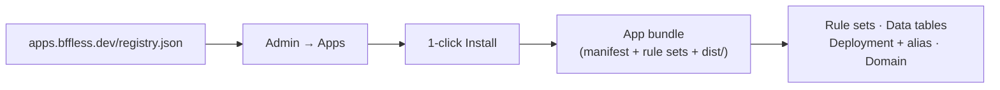

# App Catalog

The App Catalog installs a complete first-party BFFless app onto your instance in one click: proxy rule sets, data tables, a deployment on its own alias, and a domain mapping — all from **Admin → Apps**, with no GitHub Actions, API keys, or manual rule-set import required.

## Overview

Each catalog entry is a **manifest-driven bundle**: a registry index (currently just [Handoff](https://apps.bffless.dev)) points at a versioned zip containing the app's built `dist/`, its proxy rule set(s) in their already-built form, and a manifest describing where everything goes. CE fetches the bundle, verifies its checksum, and applies it through the same endpoints an operator would use by hand — the sync endpoint behind `bffless rules push`, the zip-deploy endpoint behind `upload-artifact`, and the domains API.

Nothing is written until you click **Install**. Every check the wizard can run against your instance and target project runs first, and you see the results — including a dry-run of exactly what the rule-set sync would create or reuse — before anything happens.

## Requirements

- **CE ≥ 0.4.0.** The catalog itself shipped in 0.4.0; individual apps may declare their own higher minimum (Handoff currently needs CE ≥ 0.2.0, well below the catalog's own floor).
- **The `ENABLE_APP_CATALOG` feature flag** (`FEATURE_APP_CATALOG` in `.env`) — **on by default**. Disabling it hides the **Apps** nav item and refuses the install endpoints outright.
- **Presigned-capable storage, if the app needs it.** Handoff requires presigned upload URLs. This does **not** mean you need a bucket: since CE v0.3.15, local filesystem storage supports presigned uploads (and, since 0.4.0, signed downloads too) as long as `ENCRYPTION_KEY` is set — which CE already requires at setup — and the `FEATURE_LOCAL_PRESIGNED_UPLOADS` flag hasn't been turned off (it also defaults to on). A stock local-storage install passes this check with no extra configuration. MinIO and real S3-compatible buckets work too, of course.
- **A resolvable domain**, if the app declares one (most do) — the install maps a subdomain under your `PRIMARY_DOMAIN`.

:::tip Platform mode
The catalog also works under `PLATFORM_MODE`, with the certificate step delegated to the Control Plane instead of issuing locally. It additionally requires `CONTROL_PLANE_URL` and `WORKSPACE_ID` to be configured, and it will warn (not block) that a workspace's two-label subdomain (`app.<workspace>.<platform-domain>`) isn't covered by a `*.<platform-domain>` wildcard certificate — you may need a dedicated certificate for it.
:::

## Installing an app

Open **Admin → Apps**. Each card shows the app's name, summary, and a state-driven call to action:

| Card state | What you see |
|---|---|
| Not installed, nothing blocking | **Install** button |
| Not installed, an instance-level check fails | Disabled button showing the failing check's message, with a **Why?** popover explaining the fix |
| Installed | An **Installed · vX.Y.Z** badge and an **Open ↗** link |
| Installed, newer version in the registry | An additional **Update to vX.Y.Z** button |

Clicking **Install** opens a three-screen dialog.

### 1. Review

Pick the **target project** — an existing one from the dropdown, or **Create new project…** with an owner/name pair. (A project's owner/name can never be renamed later, so this is worth getting right.) If exactly one project exists, it's preselected.

If the app declares a domain, an editable **Subdomain** field appears, pre-filled as a placeholder with the app's default (e.g. `handoff`) — type a different value to install it under a subdomain of your choosing instead. This only overrides that one install; it never changes the app's manifest.

As you fill these in, the wizard re-runs preflight (debounced ~500ms) and shows:

- **Every gate check**, instance and project level, each with a pass/fail/warn icon and, for anything not a clean pass, a **Why?** popover with remediation text and sometimes a deep link straight to the fix.
- The **dry-run sync plan** in plain language — e.g. *"27 rules created · 3 updated"* per rule set, plus *"5 data tables: 3 reused, 2 created."* If a reused table's schema doesn't quite match what the app expects, you'll see a warning naming it (this doesn't block install — reuse is the documented adoption path).

**Install** stays disabled until preflight has returned a clean result for what's currently in the form — nothing is submitted against a stale or half-typed target.

### 2. Working

A live step list, polled while the background job runs:

`Preflight checks` → `Fetch app bundle` → `Sync proxy rules` → `Deploy` → `Configure domain` → `Provision certificate` → `Set up schedules` → `Record install`

Each step shows running/done/failed/skipped, plus a short detail line (file counts, the alias the app deployed to, etc). If the DNS check needs a moment, it sits in a retryable state naming the exact record to add — add it and hit **Retry**.

If a step fails, you'll see the error and an **Undo this install** button, which removes only what this specific run created — never a pre-existing or reused resource.

### 3. Done

An **Open** button linking straight to the app, plus a checklist of any **manual steps** the app's manifest ships (things a machine genuinely can't do for you — an AI provider API key, a bucket CORS rule, and similar). Each has a checkbox to acknowledge it once done, and a deep link where one exists. The checklist only shows steps that apply to your instance — e.g. a bucket-CORS step is hidden entirely on a local-storage, same-origin install.

## Preflight gates

| Gate | Scope | Meaning | What to do |
|---|---|---|---|
| **Storage** | Instance | The app needs presigned upload URLs and the active adapter doesn't support them | Set `ENCRYPTION_KEY` (usually already set) and leave `FEATURE_LOCAL_PRESIGNED_UPLOADS` on for local storage, or enable MinIO / point at a real S3-compatible bucket |
| **CE version** | Instance | This instance's CE version is below the app's `requires.ceMin` | Upgrade CE |
| **Platform config** | Instance | Platform mode is on but `CONTROL_PLANE_URL`/`WORKSPACE_ID` aren't set (fail); or a warning about wildcard certificate coverage for the two-label subdomain | Set the missing variables; provision a certificate covering the workspace subdomain if needed |
| **DNS** | Project | The app's target host doesn't resolve or didn't answer the preflight probe | **Blocking but retryable.** Add the CNAME/A record shown, then click **Retry** — nothing else about the install needs to change |
| **Name collision** | Project | An alias, rule set, domain, or reserved subdomain name is already taken by something this install doesn't own — or, for "create new project," a project with that owner/name already exists | Rename the conflicting resource, pick a different subdomain, or (for an existing project) select it from the picker instead of recreating it |
| **Data tables** | Project | A reused data table's schema has fields that don't match what the bundle expects | **Warning only — never blocks.** Review the mismatch; reuse-by-name is the intended way an app adopts your existing table |

Only **storage**, **CE version**, and a missing **platform config** are hard failures that block install outright. **DNS** is a retry loop, not a dead end. **Name collisions** are a real refusal — the wizard won't clobber something you didn't create. **Data-table mismatches** are informational.

## What gets created

A successful install produces:

- **Proxy rule sets** — synced (not overwritten) via the same rules-as-code endpoint the CLI and CI use, and attached to the app's deployment alias.
- **Data tables** — resolved by name: an existing table with a compatible schema is *reused*, not duplicated; only genuinely new tables are created. Only the tables an install *creates* are ever considered "this install's" for later cleanup purposes.
- **A deployment and alias** — the app's built `dist/` on its own alias (e.g. `handoff`), which is also where the app is reachable if it declares no domain.
- **A domain mapping** — `<subdomain>.<your-primary-domain>` (or your override from the Review screen), with a best-effort certificate step that never fails the install itself — if it can't get a cert immediately, the app stays reachable over HTTP or an existing certificate and the step reports what to check manually.
- **Pipeline schedules**, if the app declares any (skipped otherwise).

## Updating an installed app

When the registry has a newer version, the card shows **Update to vX.Y.Z**. Confirming opens a small popover with one toggle:

- **Reset to the app's shipped rules (prune)** — **off by default.** With it off, any rules you've added to the app's rule sets yourself survive the update; the sync only creates/updates what the new bundle declares. Turn it on if you want the rule set reset to exactly what the app ships.

An update re-verifies only the **instance-level** gates (storage, CE version, platform config) — the target project, alias, domain, and rule sets are already yours by definition, so there's nothing to re-collide-check. It reuses the app's shipped `dist/` under the **same alias**, which means the alias's own deployment history is your rollback mechanism if an update goes wrong.

:::caution No undo on a failed update
Undo isn't offered for a failed update — a failed update's tracked resources are the *original* install's, so undoing it would delete that install (data tables included). Nothing was removed on a failed update; the previous version is still live in the alias's deployment history, so roll back there, or fix the underlying cause and run the update again.
:::

## Uninstalling an app

Uninstall opens a dedicated confirmation dialog. By default it removes only the app's own infrastructure — **rule sets, alias, domain, and deployment** — and **keeps your data tables and uploaded files**.

A checkbox, **Also delete the app's data tables**, shows the real record count before you commit (e.g. *"this deletes 412 records across 3 tables"*), and only ever deletes tables **this install created** — a table it merely reused is always kept, and is listed separately under "Kept regardless."

If any deletion fails partway through, the install record is **kept** (not silently dropped) so you can retry — the dialog surfaces exactly which objects failed to remove. Stored objects under the project (files in the bucket/local storage) always remain regardless of the data-table choice; delete the project itself for full cleanup.

## Ejecting an app (own it yourself)

**Eject** is the "take ownership" path for an app you want to customize. It renders:

- A **fork** link to the app's source repository on GitHub.
- The exact **Actions variables** (with copy buttons) the fork's deploy workflow needs.
- The **Actions secrets** it needs — with an inline **Mint API key** button that creates a BFFless API key scoped to your app's project, so you never have to leave the panel.
- The **workflow file** to run in your fork.

Fork it, set the variables/secrets, and run the workflow. Its **first deploy lands on the same alias your 1-click install used** — so ejecting doesn't restart anything; your fork simply becomes the ongoing deploy target for the app that's already running.

## 1-click install vs. fork-and-deploy

These are **two alternative ways to run a BFFless app**, not a beginner path and an advanced path:

- **1-click install** is the fastest way to get an app running with a real, working configuration, and it keeps you on the maintainer's updates going forward.
- **Fork and deploy yourself** (following the app's own `GETTING-STARTED.md` in the [apps monorepo](https://github.com/bffless/apps)) is the right starting point if you already know you want to customize the app's code, pipelines, or UI.

**Eject** is the bridge between them: start with 1-click, and eject later if you decide you want to customize — you keep the same URL and don't lose anything by switching.

## Self-hosted / air-gapped registries

The catalog fetches its index from `APPS_REGISTRY_URL`, which defaults to `https://apps.bffless.dev/registry.json` and is cached for about an hour. Set `APPS_REGISTRY_URL` to point at your own self-published registry for an air-gapped deployment or a private catalog of internal apps — the format is documented alongside the [BFFless Apps](https://github.com/bffless/apps) monorepo.

:::note Why there's no "install from any URL" field
The catalog deliberately has no field for pasting an arbitrary bundle URL. An app bundle carries real, server-side executable pipeline/handler code — not just static assets — so the install surface is intentionally curated to registries you've configured at the instance level (first-party, or your own), never a link a logged-in admin happens to paste in.
:::

## Troubleshooting

### "Catalog unavailable — installed apps unaffected"

The registry fetch failed — usually a network issue reaching `APPS_REGISTRY_URL`, or a misconfigured override. This banner is dismissable and doesn't affect anything already installed: **Open**, **Update**, and **Uninstall** on existing installs keep working normally. Fix connectivity/the URL and reload to see the catalog again.

### An install failed partway through

The Working screen shows exactly which step failed and why. The install record is kept (not silently discarded) so you can either fix the underlying issue and retry, or click **Undo this install** to remove everything that specific run created — it never touches a resource it didn't create itself, even if that resource happens to share a name.

### An uninstall didn't fully complete

If any deletion fails, the app's record and any leftover resources are kept for retry rather than being silently orphaned. The dialog lists which objects failed to remove — resolve the underlying issue (e.g. a resource locked by something else) and uninstall again; already-removed objects are treated as done and won't be retried.

## Related Features

- [Proxy Rules](/features/proxy-rules/) — the rule-set sync mechanism the installer applies under the hood
- [Proxy Rules as Code](/recipes/proxy-rules-as-code/) — the same sync endpoint, driven from your own git repo and CI
- [Storage Overview](/storage/overview/) — presigned upload support across storage backends
