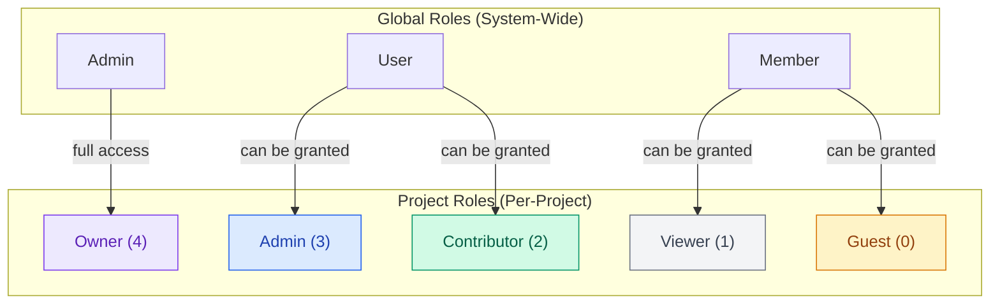
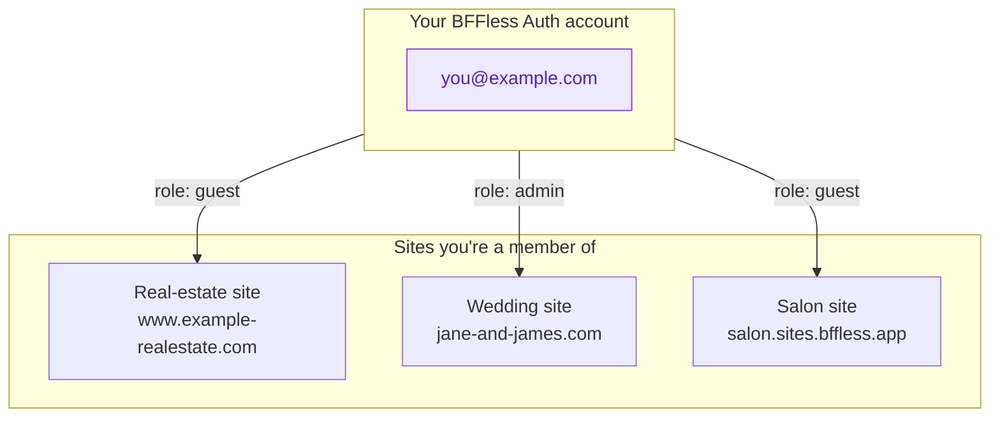

# Authorization

Watch the walkthrough (jumps to the Authorization section):

<YouTubeEmbed id="v9Xh1G_y8yM" title="BFFless: Authorization Walkthrough" start={65} />

BFFless uses a two-level permission system: **global roles** for system-wide access and **project roles** for per-project permissions.

## Overview



## BFFless Auth as identity provider

BFFless Auth is the identity provider for every site you host on a BFFless workspace. **One account works across every site you're a member of**, the same way "Sign in with Apple" or Auth0 work — sites consume that identity rather than minting their own.



### My Sites — the central account hub

Visit `https://admin.sites.bffless.app/account` (or `https://admin.<your-workspace>/account` on self-hosted CE) to see and manage your identity. The page shows:

- The account you're signed in as
- Change Password, MFA, and connected sign-in methods (Google, etc.)
- **My Sites** — every site you currently belong to, with the role you hold there

`<AuthDialog>` on consumer sites links here via the "Powered by BFFless Auth · Manage account" footer.

### Leaving a site

Each card on the My Sites page has a **Leave** button. Leaving:

- Revokes your project membership immediately
- Does **not** delete or change your BFFless Auth account
- Is reversible only by the site owner re-inviting you

You **cannot leave a site you own** — the Leave button is disabled, and the API rejects the request with a 400. Transfer ownership to another member first (see [Transferring Ownership](#transferring-ownership)), then leave.

### One identity, scoped per project

Authentication (your credentials) is workspace-wide; **authorization (your access to a specific site) is per-project**. A user signed in via BFFless Auth still needs an explicit project membership to access a site's user features. New site visitors join via:

- An invitation from a site admin (always available)
- Self-signup, when the site owner has enabled `allowPublicSignup` for that project

Visiting a private site you have no membership in returns a 403 page that links you back to your account hub — so it's always clear which identity you're signed in as and where to manage it.

:::info Workspace opt-in
The per-project membership enforcement described above is gated by a workspace-level master switch, `REQUIRE_PROJECT_MEMBERSHIP`, which **defaults to off** for back-compat. Without it, any workspace user can sign in on any site under the workspace. See [Project membership gate](#project-membership-gate) below to enable it.
:::

## Project membership gate

A workspace-level master switch controls whether having a project role is sufficient to use a BFFless-hosted site, or whether the user must *also* have an explicit project-membership row for the project the hostname maps to.

This is effectively a third layer on top of the existing [global roles](#global-roles) and [project roles](#project-roles):

```
┌────────────────────────────────────────────────────────┐
│ L1 · Global role         Admin / User / Member         │
│ L2 · Project role        Owner ... Guest               │
│ L3 · Project membership  row present? yes / no   (new) │
└────────────────────────────────────────────────────────┘
```

L1 and L2 describe *what* a user can do once they're recognized. L3 is the precondition that decides whether they're recognized as a user on this site at all. When L3 fails, the user is treated as anonymous on that specific site regardless of their global role.

### The master switch: `REQUIRE_PROJECT_MEMBERSHIP`

| Property | Value |
|---|---|
| Type | Workspace-level feature flag |
| Default | `false` (back-compat — current behavior preserved) |
| Toggle UI | `admin.<your-workspace>/admin/settings/auth` → **Project Membership** card |
| Env override | `FEATURE_REQUIRE_PROJECT_MEMBERSHIP=true` |


When **`false`**, every membership check in this section is skipped and BFFless authenticates exactly as documented above — credentials valid against the workspace user pool is enough.

When **`true`**:

- `POST /signin` rejects the request if the user has no membership in the project that maps to the request hostname.
- `GET /session` returns `{ user: null }` for an authenticated user without project membership — this is what closes the cross-subdomain cookie bleed (SuperTokens cookies live on the workspace parent domain).
- Authenticated data routes are gated by a global `ProjectMembershipGuard`. Routes that should remain reachable for non-members (auth endpoints themselves, public-content serving) opt out with a `@PublicProjectAccess()` decorator.
- The admin domain (`admin.<your-workspace>`) bypasses the gate so admin and staff workflows still work as before.

### Who should turn it on

| Workspace shape | Recommendation |
|---|---|
| Single owner, all internal projects | Leave off — SSO across your own sites is convenient. |
| Multi-customer or whitelabel hosting | Turn on — each customer's site needs independent auth; cookie bleeds between sister sites are a security and UX issue. |
| Mixed (some internal, some public-facing) | Turn on, then use `allowPublicSignup` per project to decide which sites accept self-signup. |

### Per-project signup: `projects.allowPublicSignup`

When the master switch is on, the signup endpoint is gated per project. The boolean column `projects.allowPublicSignup` (default `false`) controls whether visitors can self-register on a given site:

- **`false`** — signup is disabled; only users invited via the Members tab can join. The endpoint returns `PUBLIC_SIGNUP_DISABLED`.
- **`true`** — anyone can sign up; the user is auto-granted the `guest` role on first signup. Existing-email collisions receive a friendly "account exists — sign in instead" response.

Toggle it in **Project Settings → Members → Allow public signup**. The toggle is disabled with an explainer when the workspace master switch is off (the per-project flag has no effect in that state).

:::note Two different `allowPublicSignup*` flags
The per-project `projects.allowPublicSignup` (this section) is distinct from the workspace-wide `system_config.allowPublicSignups` (note the trailing `s`), which controls whether anyone can register an account at the admin domain at all. Both default to `false`.
:::

The workspace-wide flag lives in the same **Registration Settings** card on `admin.<your-workspace>/admin/settings/auth`:


### Behavior matrix

With `REQUIRE_PROJECT_MEMBERSHIP = true`, on a hostname that resolves to a project:

| Endpoint | User state | `allowPublicSignup` | Outcome |
|---|---|---|---|
| `POST /signin` | Has membership | n/a | Sign in, mint cookies |
| `POST /signin` | No membership | n/a | Reject with opaque `WRONG_CREDENTIALS_ERROR` |
| `POST /signup` | Already a member | n/a | Treated as signin (no role downgrade) |
| `POST /signup` | Not a member | `false` | Reject with `PUBLIC_SIGNUP_DISABLED` |
| `POST /signup` | New email | `true` | Create user, auto-grant `guest`, mint cookies |
| `POST /signup` | Email exists, password matches | `true` | Auto-grant `guest` on this project, mint cookies |
| `POST /signup` | Email exists, password wrong | `true` | "Account exists — sign in instead" hint |
| `GET /session` | Has membership | n/a | Return current user |
| `GET /session` | No membership | n/a | Return `{ user: null }`; cookie is left intact |

The admin domain (`admin.<your-workspace>`) skips this entire matrix — auth there is workspace-level so admins can manage projects they aren't members of.

### Effect on the identity-provider model

When `REQUIRE_PROJECT_MEMBERSHIP` is on, the [identity-provider model](#bffless-auth-as-identity-provider) becomes load-bearing: a user has one BFFless Auth account workspace-wide, but their *presence* on any given site is decided entirely by project membership. The **My Sites** hub at `admin.<your-workspace>/account` becomes the canonical listing of sites the user can actually use, and the "Powered by BFFless Auth" footer on `<AuthDialog>` makes the cross-site identity explicit.

## Global Roles

Global roles determine system-wide capabilities. Every user has exactly one global role.

| Role | Description | Capabilities |
|------|-------------|--------------|
| **Admin** | System administrator | Full access to all projects, user management, system settings |
| **User** | Regular user | Create projects, manage own projects, access granted projects |
| **Member** | Basic member (default) | Access granted projects only, cannot create projects |

New users are assigned the **member** role by default. Admins can promote users to higher roles.

### Admin Capabilities

Admins have unrestricted access to:

- View and manage all projects
- Create, edit, and delete users
- Access system settings and configuration
- View platform analytics and logs
- Manage API keys for any user

:::info Global Admin = project Owner on every project
A user with the global **Admin** role is treated as a project **Owner** on every project in the workspace, with no explicit project-membership row required. This applies to both the API (every project-scoped endpoint short-circuits the role check) and the admin UI (edit/delete actions render everywhere).

**Exception — project-scoped API keys:** An admin user's *project-scoped* API key still only works for its declared project. The admin bypass applies to session auth and to *global* API keys minted by an admin, not to keys explicitly scoped to a single project.

**Workspace boundary:** This bypass is scoped to a single workspace. On a multi-workspace Enterprise/platform deployment, an admin on `foo.workspace.example.com` has no implicit access to `bar.workspace.example.com` — each workspace has its own database, user pool, and role assignments.
:::

### User Capabilities

Users can:

- Create new projects (become owner automatically)
- Manage projects where they have appropriate permissions
- Create personal API keys
- Invite others to their projects

### Member Capabilities

Members can:

- Access projects where they've been granted permissions
- View and interact based on their project role
- Cannot create new projects

## Project Roles

Project roles control access to individual projects. Users can have different roles on different projects.

| Role | Level | Capabilities |
|------|-------|--------------|
| **Owner** | 4 | Full control, transfer ownership, delete project |
| **Admin** | 3 | Manage permissions, all read/write operations |
| **Contributor** | 2 | Create deployments, upload assets, modify content |
| **Viewer** | 1 | Read-only access to admin backend, view deployments and files |
| **Guest** | 0 | Site access only, no admin backend access |

### Role Hierarchy

Roles are hierarchical—higher roles include all permissions of lower roles:

```
Owner (4) → Admin (3) → Contributor (2) → Viewer (1) → Guest (0)
```

### Global role gates which project roles can be granted

Project roles must stay in lane with the target user's global role. The grant API rejects mismatched combinations:

| Global role | Project roles that can be granted |
|---|---|
| **Admin** | Any (admins act as project Owners on every project already; explicit grants are rarely needed) |
| **User** | Admin, Contributor, Viewer, Guest |
| **Member** | Viewer, Guest |

To grant Contributor or Admin on a project to someone who currently has the global **Member** role, an Admin must first promote them to **User** in the Users tab, then re-grant the project role. The Members tab UI hides the disallowed options for existing members and the backend returns a 403 with a "promote first" message if the constraint is bypassed (for example, via the API directly).

The constraint reflects how the two role systems are layered: global role gates *what kind of workspace participant* you are (e.g., can you create projects?), and project role gates *what you can do within a single project* you've been added to. A Member is a workspace participant who can't be promoted to project Admin without first being promoted to a workspace User, because the implied authority would exceed their workspace standing.

Project **Owner** is never assigned via the grant API — it's set automatically when a User creates a project, or reassigned via [Transferring Ownership](#transferring-ownership). Because Members can't create projects, they cannot become an Owner without first being promoted to User.

For example, a user with **Admin** role automatically has all **Contributor** and **Viewer** permissions.

### Owner

Each project has exactly one owner. The owner:

- Has complete control over the project
- Can transfer ownership to another user
- Can delete the project
- Cannot have their access revoked (must transfer ownership first)
- Is automatically assigned when creating a project

### Admin

Project admins can:

- Grant and revoke permissions (except owner)
- Manage project settings
- Create and delete deployments
- Configure domains and traffic rules
- View all project analytics

### Contributor

Contributors can:

- Create new deployments
- Upload assets via API or GitHub Action
- Modify traffic splitting rules
- Cannot manage other users' permissions

### Viewer

Viewers have read-only access to the admin backend:

- View deployments and their status
- Browse uploaded files
- View traffic configuration
- Cannot modify anything

### Guest

Guests can access private site content but have no admin backend access:

- Can log in and view private deployments via the public URL
- Cannot see the admin dashboard, repository list, or settings
- Ideal for end users of private sites (e.g., event guests, clients)
- Use the project's "Required Role" setting with "Guest or higher" to restrict access to invited guests only

## Permission Sources

Users can receive project permissions through multiple sources:

### Direct Permissions

Permissions granted directly to a user on a project:

```
User → Project (role: contributor)
```

### Group Permissions

Permissions inherited through group membership:

```
User → Group → Project (role: viewer)
```

Groups cannot be assigned the **owner** role.

### Effective Permission

When a user has permissions from multiple sources, they receive the **highest** role:

| Direct Role | Group Role | Effective Role |
|-------------|------------|----------------|
| viewer | contributor | **contributor** |
| admin | viewer | **admin** |
| (none) | contributor | **contributor** |
| contributor | (none) | **contributor** |

## API Key Access

API keys provide programmatic access for CI/CD pipelines and automation. Only **admin** global role users can create and manage API keys.

### Project-Scoped Keys

API keys can be scoped to a specific project:

- Only works for that project
- Inherits **contributor** permissions
- Ideal for CI/CD deployments

### Global Keys

Admin users can create global API keys:

- Work across all projects
- Used for automation and integrations
- Should be carefully protected

## Public vs Private Access

Projects and deployments can be public or private:

### Public Projects

- Anyone can view deployments
- No authentication required for viewing
- Modifications still require appropriate permissions

### Private Projects

- Only users with granted permissions can access
- Unauthorized access returns 404 (hides existence)
- Or redirects to login (configurable)

### Visibility Hierarchy

Visibility can be set at multiple levels:

1. **Project level** - Default for all deployments
2. **Alias level** - Override for specific aliases (e.g., `production`)
3. **Domain level** - Override for specific custom domains

The most specific setting takes precedence.

## Managing Permissions

### Granting Permissions

Admins and owners can grant permissions:

1. Go to Project → Settings → Permissions
2. Click "Add User" or "Add Group"
3. Select the user/group and role
4. Click Save

### Revoking Permissions

1. Go to Project → Settings → Permissions
2. Find the user or group
3. Click Remove
4. Confirm revocation

### Transferring Ownership

Only owners can transfer ownership:

1. Go to Project → Settings → General
2. Click "Transfer Ownership"
3. Select the new owner
4. Confirm transfer

You will become an admin after transferring ownership.

## Permission Matrix

| Action | Owner | Admin | Contributor | Viewer | Guest |
|--------|:-----:|:-----:|:-----------:|:------:|:-----:|
| Access private site content | Yes | Yes | Yes | Yes | Yes |
| View admin backend | Yes | Yes | Yes | Yes | - |
| View deployments | Yes | Yes | Yes | Yes | - |
| Browse files | Yes | Yes | Yes | Yes | - |
| Create deployment | Yes | Yes | Yes | - | - |
| Delete deployment | Yes | Yes | - | - | - |
| Configure traffic | Yes | Yes | Yes | - | - |
| Manage domains | Yes | Yes | - | - | - |
| Manage settings | Yes | Yes | - | - | - |
| Grant permissions | Yes | Yes | - | - | - |
| Delete project | Yes | - | - | - | - |
| Transfer ownership | Yes | - | - | - | - |

## User Groups

Groups simplify permission management for teams:

### Creating Groups

1. Go to Settings → Groups
2. Click "Create Group"
3. Name the group (e.g., "Frontend Team")
4. Add members

### Assigning Group Permissions

1. Go to Project → Settings → Permissions
2. Click "Add Group"
3. Select the group and role
4. All group members inherit this permission

### Group Limitations

- Groups cannot be assigned the **owner** role
- Users can belong to multiple groups
- Removing a user from a group immediately revokes inherited permissions

## Best Practices

### Principle of Least Privilege

Grant the minimum permissions needed:

- Use **guest** for end users who only need to access private site content
- Use **viewer** for stakeholders who need read-only admin access
- Use **contributor** for developers who deploy but don't manage access
- Reserve **admin** for team leads who manage permissions

### Use Groups for Teams

Instead of granting individual permissions:

1. Create groups matching your team structure
2. Assign project permissions to groups
3. Add/remove users from groups as needed

This simplifies onboarding and offboarding.

### Protect Production

For production deployments:

- Limit who has **contributor** or higher access
- Use project-scoped API keys for CI/CD
- Review permissions regularly

### API Key Security

- Use project-scoped keys when possible
- Rotate keys periodically
- Never commit keys to source control
- Use GitHub Secrets for CI/CD

## Related Documentation

- [API Reference](/reference/api) - API authentication details
- [GitHub Actions](/deployment/github-actions) - CI/CD with API keys
- [Security](/reference/security) - Security best practices
