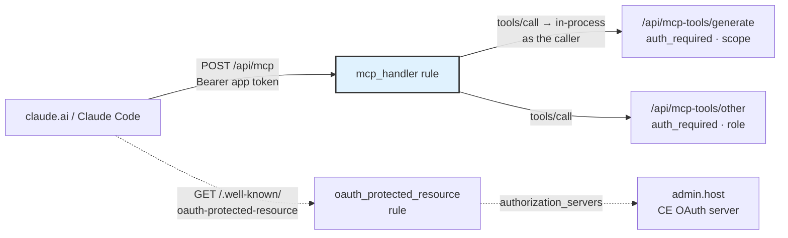

# Build an MCP Server

Give an AI agent tools that run **your** app's backend: a rule set with one `mcp_handler` step *is* an MCP server. Each tool is a sibling rule of the same alias, and the sibling's `auth_required` validator is the tool's gate. Connect it from claude.ai as a custom connector or from Claude Code over OAuth, and the agent calls your pipelines as the signed-in member.

:::info Not this one?
This page is about an MCP server **you build on your own project**. The server that lets an agent drive the BFFless **admin panel** — projects, deployments, pipelines, domains — is the [Admin MCP Server](/features/mcp-server/) at `admin.<host>/mcp`. Different thing, different page.
:::

Needs CE **v0.4.44** for `mcp_handler`, **v0.4.49** for the admin-UI form editor, and **v0.4.52** for the one-step OAuth discovery rule claude.ai needs (bffless/ce#761). Live examples: the `images` server on [bffless/presentations](https://github.com/bffless/presentations/tree/main/.bffless/proxy-rules/images) (one tool, `generate_image`) and the `workflow` server that ships with the [Workflow app](/features/app-catalog/#workflow).

## How it works



- **Stateless Streamable HTTP.** The endpoint answers one JSON-RPC message per `POST`. `GET` and `DELETE` get a `405` (no SSE, no sessions); a notification gets an empty `202`. Every answer is `Cache-Control: no-store`.
- **Tools are sibling rules.** A tool declares `rule.path` (and `GET` or `POST`). On `tools/call`, CE runs that rule **in-process as the caller** with the arguments as the body (`POST`) or the query (`GET`). The sibling's validators run as usual, so its `auth_required` is the tool's gate: `roles` for who, `requiredScopes` for what the credential was delegated.
- **The rule set is the server.** Nothing to register in CE, no server process. Attach the set to an alias and the endpoint answers on that alias's hosts. Push a new version of the set and `tools/list` changes with it.
- **Results are `CallToolResult`s.** A sibling that answers a JSON body with a `content` array is passed through verbatim. Any other `2xx` becomes text plus `structuredContent`. A `401` becomes `errors.auth`, a `403` for a missing scope becomes `errors.scope` naming it, and any other failure becomes `errors.pipeline` with the HTTP status in `_meta.bffless.status`.

## The minimum rule set

Two rules: the endpoint and one tool. A third, the OAuth discovery document, is needed as soon as you connect from claude.ai (see [Auth](#auth-session-api-key-or-oauth)).

### Rules-as-code

Rules-as-code is the power-user surface: the whole server lives in git and deploys with `bffless rules push` or the [deploy-proxy-rules](/deployment/github-actions/deploy-proxy-rules/) action. Layout, following the [proxy rules as code](/recipes/proxy-rules-as-code/) recipe:

```
.bffless/proxy-rules/images/
  ruleset.yaml
  rules/
    api/mcp/any.rule.yaml                 # the endpoint
    api/mcp-tools/generate/post/rule.yaml # one tool
    _custom/well-known/get.rule.yaml      # OAuth discovery, one step (for claude.ai)
```

**The endpoint** — `rules/api/mcp/any.rule.yaml`:

```yaml
methods: [GET, POST, DELETE]
targetUrl: pipeline
order: 30
pipeline:
  name: images MCP endpoint
  steps:
    - id: mcp
      name: mcp
      handler: mcp_handler
      config:
        serverInfo: { name: bffless-presentations-images, version: 0.1.0 }
        instructions: "One tool, generate_image. Each call costs money — confirm the prompt with the person first."
        tools:
          - name: generate_image
            description: "Generate one image. Returns a temporary URL — download it to keep it."
            inputSchema:
              type: object
              properties:
                prompt: { type: string, description: "Subject, style, composition, palette." }
                aspect_ratio: { type: string, enum: ["16:9", "1:1", "9:16"] }
              required: [prompt]
              additionalProperties: false
            annotations: { readOnlyHint: false, openWorldHint: true }
            rule: { path: /api/mcp-tools/generate, method: POST }
  validators:
    - type: auth_required
```

The `auth_required` on the endpoint itself has no config: any signed-in caller may list tools, and an anonymous call gets the `401` that starts OAuth discovery.

**The tool** — `rules/api/mcp-tools/generate/post/rule.yaml`. Any pipeline works; the tool's arguments arrive as `request.body`:

```yaml
targetUrl: pipeline
order: 40
pipeline:
  name: MCP tool generate_image
  steps:
    - id: generate
      name: generate
      handler: replicate
      config:
        model: google/nano-banana-2
        input:
          prompt: request.body.prompt
          aspect_ratio: request.body.aspect_ratio
    - id: respond
      name: respond
      handler: response_handler
      config:
        status: 200
        contentType: application/json
        body: '{"content":[{"type":"text","text":"Image ready: {{steps.generate.output.0}}"}],"structuredContent":{"url":"{{steps.generate.output.0}}"}}'
  validators:
    - type: auth_required
      config:
        roles: [admin]
        requiredScopes: [images:generate]
```

The validator is the tool's gate. `roles` matches the caller's global role (`admin`, `user` or `member`, any match). `requiredScopes` uses the `namespace:verb` shape and is checked **only for OAuth app tokens**: a session cookie or an API key passes every scope check, because a person acting as themselves is not a delegation. Scopes are your app's vocabulary; nothing is registered in CE.

:::tip
Answer the `content` array yourself, as above, when you want to control the text the model reads. Otherwise answer plain JSON and CE wraps it: the body becomes `content[0].text` and `structuredContent`.
:::

### Admin UI

The admin UI is the learning surface. In your project's **Proxy Rules**, add a rule for `/api/mcp` with **Methods** `GET, POST, DELETE`, target **Pipeline**, and one step of type **MCP Server**. The step editor is a form over the same config:

| Tab | What you set |
| --- | --- |
| **Server** | `serverInfo` name and version, `instructions`, and (under Advanced) `protocolVersions` |
| **Tools** | One card per tool: name, description, a **sibling rule picker** listing the set's rules with GET/POST, the input schema as a property table (name, type, description, required, constraints), the read-only / destructive / idempotent / open-world hints, and visibility |
| **Resources** | Static `ui://` resources, URI templates, the list rule, and CSP domains (`$app`, `$storage`) |
| **JSON** | The whole config, editable, ready to paste into rules-as-code |

A problems panel mirrors what the backend would refuse at run time, and each problem links to its tab. The sibling picker's "answered by" hint is advisory: another set attached to the same alias may answer, so saving is never blocked.

Then add the tool rule at `/api/mcp-tools/generate` (POST, pipeline) with an **Authentication Required** validator. The validator form exposes **Required Roles**; `requiredScopes` is set in rules-as-code today.

Both surfaces edit the same shape. A `bffless rules push` overwrites dashboard edits by design, so pick one as the source of truth per set.

## Auth: session, API key, or OAuth

The endpoint accepts the same credentials as every other proxied pipeline. Which one you use decides how much setup the server needs.

| Credential | How it is sent | Scopes | When |
| --- | --- | --- | --- |
| **Session cookie** | Browser session on the alias host | Pass every check | A browser-embedded client on the same host |
| **API key** | `X-API-Key` header | Pass every check | Your own Claude Code, scripts, CI. No discovery rule needed. |
| **OAuth app token** | `Authorization: Bearer bfat_…` | Enforced per tool | claude.ai connectors, or any client that should get **only** the scopes a person consented to |

An API key gets you running in one line (see [Connect a client](#connect-a-client)). claude.ai has no header field and expects the server to be an OAuth **protected resource**, which CE already is: the instance's admin host runs a built-in OAuth 2.1 authorization server with dynamic client registration (RFC 7591), PKCE, and the metadata documents clients look for (RFC 8414, RFC 9728, RFC 8707). What the server needs from you is one more rule with one step.

### The discovery document (RFC 9728)

A client with no credential first reads `GET https://<host>/.well-known/oauth-protected-resource`, which names the resource, the authorization server, and the scopes it may ask for. CE's `401` already points there with a `WWW-Authenticate: Bearer resource_metadata="…"` hint. The document itself is served by a rule in your set with the **`oauth_protected_resource`** handler. The handler answers regardless of deployment visibility (the caller by definition has no credential yet), so there is no `bypassVisibility` to remember, and it names CE's real OAuth issuer as the authorization server, so there is no admin host to get wrong.

`rules/_custom/well-known/get.rule.yaml`:

```yaml
pathPattern: /.well-known/oauth-protected-resource*
targetUrl: pipeline
order: 32
pipeline:
  name: OAuth protected-resource metadata
  steps:
    - id: prm
      name: prm
      handler: oauth_protected_resource
      config:
        resource: /api/mcp
        # scopes: [images:generate]   # optional — see below
        # resourceName: Presentations images
```

In the admin UI it is the same rule: path `/.well-known/oauth-protected-resource*`, method `GET`, target **Pipeline**, one step of type **OAuth Discovery (MCP)** (under *Other*), with **Resource** set to the MCP endpoint's path. The form says which `mcp_handler` rule it found in the set and which scopes it will derive. For `rag.bffless.dev` it answers:

```json
{
  "resource": "https://rag.bffless.dev/api/mcp",
  "authorization_servers": ["https://admin.bffless.dev"],
  "scopes_supported": ["images:generate"],
  "bearer_methods_supported": ["header"],
  "resource_name": "bffless-presentations-images"
}
```

`resource` is built from the request host plus the configured path, which must be a literal path (no wildcard, query or fragment). The path-suffixed form `…/oauth-protected-resource/api/mcp` answers the same document; a suffix naming any other path is a `404`. `resource_name` defaults to the `mcp_handler`'s `serverInfo.name`, and `resourceDocumentation` (a URL) is passed through as `resource_documentation`. The response is cached for five minutes.

The visibility bypass is deliberately narrow: it applies only when the rule's path answers `/.well-known/oauth-protected-resource*` and this step is its first enabled step. A rule at another path, or one that runs any step before it, is gated like any other rule.

**`scopes` is a security setting, not a description.** `scopes_supported` is the allowlist the consent page and the token grant enforce: a client asking for a scope outside it is refused, and a client asking for nothing is granted the whole list. Left out, the handler derives the list from every `requiredScopes` on the `auth_required` validators of the tools' sibling rules, which is the right default when every tool is meant to be reachable over OAuth. Set it explicitly when it should be narrower, for example to keep a scope meant for CI API keys out of what claude.ai can ever request. Whatever you choose, a tool whose scope is missing from the list can never be called with an OAuth token.

**How to know it is wired up.** The `mcp_handler` step's **Server** tab states where discovery comes from and shows `scopes_supported` as *declared* or *derived*, with the list. With no discovery rule in the set it says so and tells you what to add.


From outside, probe the document with no credential:

```bash
curl -s https://rag.bffless.dev/.well-known/oauth-protected-resource
```

It must answer `200` with the JSON above, even on a private deployment.

:::note Before CE v0.4.52
Older instances have no `oauth_protected_resource` handler. There the same document is served by a `function_handler` that derives every URL from the request host, plus a `response_handler`, on a rule marked `bypassVisibility: true`. The [bffless/presentations](https://github.com/bffless/presentations/tree/main/.bffless/proxy-rules/images/rules/_custom/well-known) rule set carries a working copy. Two cautions with that approach: `authorization_servers` is guessed as `admin.` plus the parent domain, so hard-code your issuer if the admin host is elsewhere; and `scopes_supported` is whatever the function lists, so keep it in step with the tools' `requiredScopes`. An explicit rule at that path keeps winning after an upgrade, so the copy keeps working until you replace it with the handler.
:::

### What happens on connect

1. The client calls `POST /api/mcp` with no credential and gets `401` with the `resource_metadata` hint.
2. It reads the discovery document, then the authorization server's metadata at `https://admin.<host>/.well-known/oauth-authorization-server`, and registers itself (`POST /api/oauth/register`, public clients only).
3. It sends the person to `GET /api/oauth/authorize` with PKCE and the `resource` URL. Not signed in on the admin host? The login page round-trips back.
4. The **consent page** on the admin SPA lists the requested scopes, one checkbox each. The person can narrow the grant.
5. The client exchanges the code at `POST /api/oauth/token`. The access token is an **app token**: bound to the project the resource host resolves to, carrying the granted scopes, valid for one hour, refreshed with rotation for 30 days. In your pipelines it is the member: `user.id`, `user.scopes` and `user.credential` are readable by expressions and `function_handler` steps.

A person can revoke a grant from **User Settings → App Tokens** in the admin UI.

## Connect a client

**claude.ai.** Settings → Connectors → Add custom connector, and paste the endpoint URL (`https://rag.bffless.dev/api/mcp`). claude.ai runs the OAuth flow above; after consent the tools appear in every chat where the connector is enabled.

**Claude Code, OAuth.** Commit a `.mcp.json` with no secrets in it:

```json
{
  "mcpServers": {
    "images": {
      "type": "http",
      "url": "https://rag.bffless.dev/api/mcp"
    }
  }
}
```

Run `/mcp` in Claude Code to authenticate; it opens the same consent page in the browser.

**Claude Code, API key.** Skip OAuth for your own use:

```bash
claude mcp add --transport http images https://rag.bffless.dev/api/mcp --header "X-API-Key: YOUR_API_KEY"
```

**Check it by hand.** A `tools/list` with an API key:

```bash
curl -s -X POST https://rag.bffless.dev/api/mcp -H "Content-Type: application/json" -H "X-API-Key: YOUR_API_KEY" -d '{"jsonrpc":"2.0","id":1,"method":"tools/list"}'
```

## Worked example: `generate_image`

The [bffless/presentations](https://github.com/bffless/presentations) repo ships an `images` server so Claude can render slide art with Replicate's `google/nano-banana-2`. It is the project's **default** rule set, so the endpoint answers on every deck host. The pieces:

- **Endpoint** `rules/api/mcp/any.rule.yaml` — one `mcp_handler` step declaring `generate_image` (`prompt`, `aspect_ratio`, up to three `reference_images`), pointed at `/api/mcp-tools/generate`. Validator: `auth_required`, no config.
- **Tool** `rules/api/mcp-tools/generate/post/rule.yaml` — four steps. `prep` (a `function_handler`) validates and normalises the arguments and answers `{ ok: false, error }` for bad input. `generate` (the `replicate` handler) runs only when `steps.prep.ok`, so a refused call never reaches Replicate and costs nothing. `reply` turns the output into a `CallToolResult`: the text tells the model the URL is valid for about an hour and to save it now; `structuredContent` carries `url`, `model`, `aspect_ratio` and `prompt`. `respond` answers it with `Cache-Control: no-store`. Validator: `roles: [admin]`, `requiredScopes: [images:generate]`.
- **Discovery** `rules/_custom/well-known/get.rule.yaml` — the RFC 9728 document. The repo's copy still uses the hand-written `function_handler` form from the note above; on a current CE it is the one-step `oauth_protected_resource` rule.
- **Client** `.mcp.json` at the repo root with the OAuth URL only, plus a `generate-image` skill that asks before each paid call and saves the result into the deck's assets.

The function steps have `*.fn.test.yaml` files next to them, so `bffless rules test` covers the argument validation and the result shaping without calling Replicate.

## `ui://` resources and MCP Apps

Beyond tools, an `mcp_handler` can serve **resources**, and `ui://` resources are how an MCP App (the ext-apps pattern) gets its HTML into a host like claude.ai:

- `resources.static` — fixed URIs, each answered by a sibling rule.
- `resources.templates` — RFC 6570 level-1 templates (`{var}` one segment, `{var+}` a slash-carrying tail) mapped to a sibling path with the same variables, for example `ui://bffless/{impl}/{path+}` → `/w/{impl}/{path+}`.
- `resources.list` — a sibling whose JSON answer is the resources array the host enumerates.
- `resources.csp` — the `connectDomains` and `resourceDomains` every resource's `_meta.ui.csp` carries; `$app` expands to the request's origin, `$storage` to the storage backend's.

A tool can carry `_meta.ui.resourceUri` to name the resource that renders it, and `visibility: [app]` marks a tool that only the embedded app calls, not the model. The [Workflow app](/features/app-catalog/#workflow) is the reference: its run page mounts as a `ui://` step view inside claude.ai, and its [writing an implementation](https://github.com/bffless/apps/blob/main/apps/workflow/docs/writing-an-implementation.md) guide covers what an implementation needs (nothing extra, in practice).

## Troubleshooting

- **claude.ai says it cannot connect / never shows consent.** The discovery rule is missing, or its `resource` path does not match the endpoint rule. Fetch `https://<host>/.well-known/oauth-protected-resource` with no credential; it must answer `200` with the JSON above. On a hand-written pre-v0.4.52 copy, also check `bypassVisibility: true` and that `authorization_servers` is your admin host.
- **`invalid_scope` at authorize.** The client asked for a scope missing from `scopes_supported`. Add it to `scopes`, or, if the list is derived, to a tool rule's `requiredScopes`.
- **A tool answers `insufficient_scope: missing …`.** The token was consented with fewer scopes than the tool's `requiredScopes`. Reconnect and grant the scope. Sessions and API keys never hit this.
- **`<tool> is declared but no rule answers <path>`.** The tool's `rule.path` matches no rule in any set attached to this alias. Check the path and method, and that the tool's set is attached.
- **`MCP_RECURSION`.** A tool's sibling is itself an `mcp_handler` rule. Tools must be ordinary pipelines.
- **`405` on `GET`.** Expected. The endpoint is stateless; clients must `POST`.

## Related

- [Admin MCP Server](/features/mcp-server/) — the built-in server for driving the admin panel
- [Proxy Rules as Code](/recipes/proxy-rules-as-code/) — the git workflow these files live in
- [Pipelines](/features/pipelines/) — handlers you can chain inside a tool rule
- [Authorization](/features/authorization/) — the global roles `auth_required` matches
- [App Catalog → Workflow](/features/app-catalog/#workflow) — the shipped server with `ui://` resources
