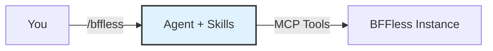

# Skills

The BFFless skills give your AI assistant deep knowledge of the BFFless platform — deployments, pipelines, proxy rules, domains, chat, and more. Instead of reading docs yourself, just describe what you want and the assistant handles the rest.

Skills were originally built for [Claude Code](https://docs.anthropic.com/en/docs/claude-code) and are distributed as a Claude Code plugin, but they're plain markdown — also compatible with the open-source [`skills`](https://www.npmjs.com/package/skills) CLI, which lets you install them into any agent that reads from a `.skills/` (or similar) directory.



## Why Use the Skills?

The [MCP Server](/features/mcp-server) gives your agent access to BFFless tools (create projects, manage deployments, etc.), but the tools alone don't teach _how_ to use them effectively. The skills add:

- **Domain knowledge** — Concepts like aliases, pipeline handlers, proxy rule sets, and traffic splitting
- **Guided workflows** — Ask for "a contact form with email notifications" and the agent knows the exact handler chain to build
- **Best practices** — Patterns like "all proxy rules must go in a single rule set per project" and "assign rule sets to aliases for them to take effect"
- **Reference for every feature** — Chat setup, auth patterns, the `use-bff-state` React hook, GitHub Actions CI/CD, and more

## Prerequisites

- An AI coding agent (Claude Code, or any agent that supports the `skills` CLI format)
- A BFFless instance with an API key (see [MCP Server — Setup](/features/mcp-server#setup))
- The BFFless MCP server connected to your agent

If you haven't set up the MCP server yet, see the [MCP Server](/features/mcp-server) page first.

## Installation

### Claude Code (plugin marketplace)

From within Claude Code, add the marketplace and install:

```
/plugin marketplace add bffless/skills
/plugin install bffless
```

Or via CLI:

```bash
claude plugin install bffless --scope user
```

Then reload plugins to activate:

```
/reload-plugins
```

### Any agent (via `npx skills`)

The same repo works with the open-source [`skills`](https://www.npmjs.com/package/skills) CLI. From your project root:

```bash
# List available BFFless skills
npx skills add bffless/skills --list

# Install all skills
npx skills add bffless/skills

# Install a specific skill
npx skills add bffless/skills --skill chat
```

This clones the [`bffless/skills`](https://github.com/bffless/skills) repo and copies the selected skills into your project so any compatible agent can read them.

## Available Skills

| Skill                 | Description                                                                                          |
| --------------------- | ---------------------------------------------------------------------------------------------------- |
| **authentication**    | Cross-domain authentication using the admin login relay pattern, built-in `/_bffless/auth` endpoints, and cookie-based sessions |
| **authorization**     | Two-level permission system with global and project roles                                            |
| **bffless**           | Knowledge about the BFFless platform, features, and setup                                            |
| **cache-and-storage** | Cache rules for HTTP caching headers, storage backends, API keys for CI/CD, and user roles          |
| **chat**              | Adding AI chat to a site with full-page or popup widget layouts, skills, streaming, and message persistence |
| **pipelines**         | Backend automation without code using handler chains                                                 |
| **proxy-rules**       | Forward requests to backend APIs without CORS                                                        |
| **repository**        | Browse deployments, manage aliases, view branches                                                    |
| **share-links**       | Token-based sharing for private deployments                                                          |
| **traffic-splitting** | Distribute traffic across aliases with weights and rules                                             |
| **upload-artifact**   | GitHub Action for uploading build artifacts to BFFless                                               |
| **use-bff-state**     | React hook for managing server-side state with BFFless Data Tables and Pipelines                     |

## Usage (Claude Code)

Invoke the skill bundle with the `/bffless` slash command:

```
/bffless
```

This loads BFFless domain knowledge into your current conversation. From there, just describe what you want in plain language:

> "Set up a chat endpoint with message persistence for my project"

> "Create a proxy rule that forwards /api/weather to a weather API"

> "Add a custom domain for my landing page project"

> "Build a pipeline that validates a contact form, saves it to a DB Record, and sends an email"

The agent will use the MCP tools to execute each step, applying the correct patterns automatically.

### When to load BFFless skills

Load them when you're about to do BFFless-related work:

| Task                  | Example Prompt                                                              |
| --------------------- | --------------------------------------------------------------------------- |
| **Deploy & promote**  | "Show my latest deployments and promote the newest to production"           |
| **Build APIs**        | "Create GET and POST endpoints for a todos schema at /api/todos"            |
| **Set up chat**       | "Add AI chat to my project with Anthropic and message persistence"          |
| **Configure domains** | "Map blog.example.com to my blog project's production alias"                |
| **Manage data**       | "Query the last 10 records from my contacts schema"                         |
| **CI/CD setup**       | "Show me a GitHub Actions workflow that deploys to BFFless on push to main" |
| **Debug pipelines**   | "Enable debug logging on /api/contacts and show recent logs"                |

You don't need to invoke `/bffless` for every message — once loaded, the knowledge persists for the rest of the conversation.

## Example Session

Here's what a typical interaction looks like:

```
You:  /bffless
      I want to add a contact form to my project "acme/website" that saves
      submissions and emails me

Agent: I'll set that up. Let me:
       1. Create a "contacts" DB Record with name, email, and message fields
       2. Create a proxy rule set for the project
       3. Add a POST /api/contact pipeline with form_handler → data_create → email_handler
       4. Assign the rule set to your production alias

       [executes each step via MCP tools]

       Done! Your contact form endpoint is live at POST /api/contact.
       Here's a React component to use it: ...
```

## Updating

**Claude Code:**

```
/plugin uninstall bffless
/plugin install bffless
/reload-plugins
```

**`npx skills`:** re-run `npx skills add bffless/skills` to pull the latest version.

## Troubleshooting

**Plugin not found after install (Claude Code)?**
Run `/reload-plugins` to activate newly installed plugins.

**MCP tools not working?**
Skills provide knowledge but rely on the MCP server for tool execution. Verify your MCP connection:

1. Check that the `bffless` MCP server is configured in your agent
2. Ensure your API key is valid and has appropriate permissions
3. See [MCP Server — Setup](/features/mcp-server#setup) for connection details

**Domain knowledge not loading?**
In Claude Code, make sure you invoke `/bffless` at the start of your conversation — the plugin loads context on demand, not automatically. With the `npx skills` CLI, confirm the skill files were copied into your project directory.

## Related Features

- [MCP Server](/features/mcp-server) — Raw MCP tool access for programmatic BFFless management
- [Pipelines](/features/pipelines) — Backend automation with chained handlers
- [Chat](/features/chat) — AI-powered chat with streaming and persistence
- [Proxy Rules](/features/proxy-rules) — API endpoints and request routing
