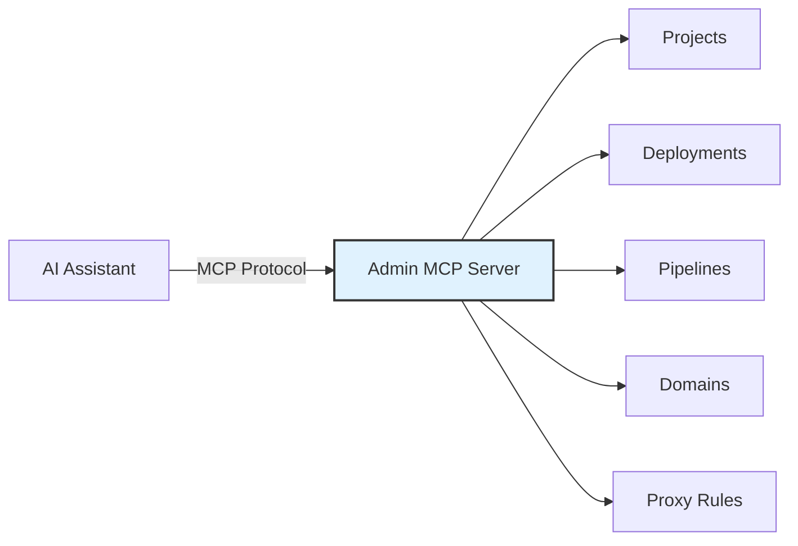

# Admin MCP Server

Watch the walkthrough (jumps to the Install MCP Server section):

<YouTubeEmbed id="SgUtqbSge6o" title="BFFless: Using Skills and MCP to Update Pipelines" start={140} />

Every BFFless instance ships an [MCP](https://modelcontextprotocol.io/) server for its **admin panel**. It exposes the admin operations as tools — projects, deployments, aliases, domains, pipelines, proxy rules, cache rules, users, API keys — so an AI assistant such as Claude Code can create, update and query them on your behalf. It lives at `admin.<host>/mcp` and authenticates with an API key.

:::info Not this one?
This server manages **BFFless itself**. If you want to give an agent tools that run **your own app's backend** — an MCP server you build on a project, with tools that are pipelines, connected from claude.ai or Claude Code over OAuth — that is the `mcp_handler` pipeline step. See [Build an MCP Server](/features/build-an-mcp-server/).
:::



## Setup

### 1. Create an API key

Navigate to **Settings → API Keys** in your BFFless admin panel and create a new key. Copy it — you'll need it for the next step.

:::tip
API keys can be scoped to a specific project or granted global access. For AI assistants, a global key is usually most convenient.
:::

### 2. Connect your MCP client

#### Claude Code

```bash
claude mcp add --transport http bffless https://admin.yourdomain.com/mcp --header "X-API-Key: YOUR_API_KEY"
```

This adds the server to your `~/.claude.json` configuration:

```json
{
  "mcpServers": {
    "bffless": {
      "type": "http",
      "url": "https://admin.yourdomain.com/mcp",
      "headers": {
        "X-API-Key": "YOUR_API_KEY"
      }
    }
  }
}
```

#### Cursor / other MCP clients

Add the following to your MCP client configuration:

- **Transport:** Streamable HTTP
- **URL:** `https://admin.yourdomain.com/mcp`
- **Header:** `X-API-Key: YOUR_API_KEY`

### 3. Verify the connection

Ask your AI assistant to list your projects:

> "List all my BFFless projects"

The assistant will call the `list_projects` tool and return your project list.

### Connecting multiple instances

Connect to several BFFless instances at once by giving each a unique name:

```bash
claude mcp add --transport http bffless-production https://admin.production.yourdomain.com/mcp --header "X-API-Key: PROD_KEY"
claude mcp add --transport http bffless-staging https://admin.staging.yourdomain.com/mcp --header "X-API-Key: STAGING_KEY"
```

Each instance is fully isolated — tools are scoped to the workspace they're connected to.

### How it connects

| | |
| --- | --- |
| **Endpoint** | `https://admin.<your-domain>/mcp` (for self-hosted instances, `admin.<PRIMARY_DOMAIN>`) |
| **Auth** | `X-API-Key` header — the same keys as the REST API; a key created in the admin panel works for both |
| **Transport** | Streamable HTTP, stateless, JSON responses: no persistent connection, each request independent, proxy- and load-balancer-friendly |
| **Rate limits** | Same as the REST API. For high-volume automation, call the REST API directly. |

Pair it with the [Claude Code plugin](/features/claude-code-plugin/): the MCP server gives the assistant the tools, the plugin's skills teach it how to use them.

## Available tools

### Projects

| Tool | Description |
|------|-------------|
| `list_projects` | List all projects accessible to the current user |
| `get_project` | Get a project by owner and name |
| `create_project` | Create a new project |
| `update_project` | Update project settings (display name, description, visibility) |
| `delete_project` | Delete a project and all its deployments, aliases, and storage files |

### Deployments & aliases

| Tool | Description |
|------|-------------|
| `list_deployments` | List deployments with optional filters (repository, branch, commit SHA) |
| `get_deployment` | Get deployment details including files and aliases |
| `delete_deployment` | Delete a deployment and its files from storage |
| `list_aliases` | List aliases for a project |
| `create_alias` | Create a new alias pointing to a commit SHA |
| `update_alias` | Update an alias to point to a different commit SHA |
| `delete_alias` | Delete an alias |

### Domains

| Tool | Description |
|------|-------------|
| `list_domains` | List all domain mappings |
| `get_domain` | Get domain details |
| `create_domain` | Create a subdomain, custom domain, or redirect |
| `update_domain` | Update domain settings |
| `delete_domain` | Remove a domain mapping |

### Pipeline schemas & data

| Tool | Description |
|------|-------------|
| `list_pipeline_schemas` | List all schemas for a project |
| `get_pipeline_schema` | Get schema details with record count |
| `create_pipeline_schema` | Create a schema with typed fields |
| `update_pipeline_schema` | Update schema name or fields |
| `delete_pipeline_schema` | Delete a schema and all its data |
| `generate_upload_schema` | Generate a file upload schema with upload/serve pipelines |
| `query_pipeline_data` | Query records with pagination, search, and sorting |
| `get_pipeline_record` | Get a single record by ID |
| `create_pipeline_record` | Create a new data record |
| `update_pipeline_record` | Update an existing record |
| `delete_pipeline_record` | Delete a record |

### Proxy rules

| Tool | Description |
|------|-------------|
| `list_proxy_rule_sets` | List rule sets for a project |
| `get_proxy_rule_set` | Get rule set details with all rules |
| `create_proxy_rule_set` | Create a new rule set |
| `delete_proxy_rule_set` | Delete a rule set |
| `get_proxy_rule` | Get a single proxy rule |
| `create_proxy_rule` | Create a rule (path + method + pipeline config) |
| `update_proxy_rule` | Update a proxy rule |
| `delete_proxy_rule` | Delete a proxy rule |

### Cache rules

| Tool | Description |
|------|-------------|
| `list_cache_rules` | List cache rules for a project |
| `get_cache_rule` | Get cache rule details |
| `create_cache_rule` | Create a cache policy for a path pattern |
| `delete_cache_rule` | Delete a cache rule |

### Pipeline debugging

| Tool | Description |
|------|-------------|
| `enable_pipeline_debug` | Toggle debug logging on a proxy rule |
| `list_pipeline_logs` | List execution logs for a proxy rule |
| `get_pipeline_log` | Get full execution log with step details |
| `get_pipeline_log_step` | Get input/output for a specific pipeline step |

### Users & API keys

| Tool | Description |
|------|-------------|
| `list_users` | List all users |
| `get_user` | Get user details |
| `update_user_role` | Change a user's role |
| `list_api_keys` | List all API keys |
| `create_api_key` | Create a new API key |
| `delete_api_key` | Revoke an API key |

### Settings

| Tool | Description |
|------|-------------|
| `get_primary_content_config` | Get which project/alias serves on the root domain |
| `update_primary_content_config` | Update the primary content configuration |

## Things to ask

A few prompts that exercise the tools end to end; the assistant chains the calls itself.

- **Deploy a site:** "Create a project called `my-org/landing-page`, set up a production alias and map it to `landing.example.com`" — `create_project` → `create_alias` → `create_domain`.
- **Build a data-backed API:** "Create a contacts schema with name, email and company fields, then GET and POST endpoints at `/api/contacts`" — `create_pipeline_schema` → `create_proxy_rule_set` → `create_proxy_rule` ×2 (`data_query`, `data_create`).
- **Promote or roll back:** "Promote the latest `my-org/app` deployment to production" / "Roll production back to the previous deployment" — `list_deployments` → `update_alias`.
- **Debug a pipeline:** "Enable debug logging on `/api/contacts` and show me the last few runs" — `enable_pipeline_debug` → `list_pipeline_logs` → `get_pipeline_log`.

## Related features

- [Build an MCP Server](/features/build-an-mcp-server/) — ship your own MCP server on a project with the `mcp_handler` step
- [Claude Code Plugin](/features/claude-code-plugin/) — skills that teach the assistant how to use these tools
- [Pipelines](/features/pipelines/) — pipeline schemas, field types, and handler configurations
- [Proxy Rules](/features/proxy-rules/) — setting up API endpoints with proxy rules
- [Proxy Rules as Code](/recipes/proxy-rules-as-code/) — keep the rule sets these tools edit in git instead
- [AI Pipelines](/features/ai-pipelines/) — AI-powered chat and content generation
