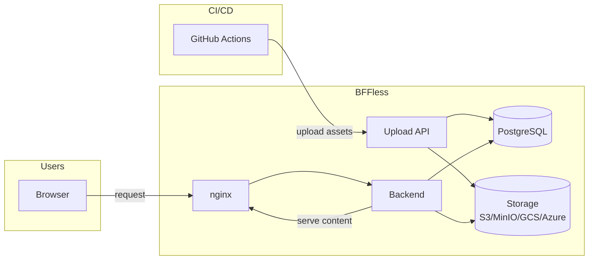

<YouTubeEmbed id="luQMEUYzsUQ" title="BFFless - a home for your AI-generated apps, internal tools, and HTML docs" />

# Welcome to BFFless

BFFless is the home for your AI-generated apps, internal tools, and HTML docs — with a backend, auth, and a path to your internal services. Point any static build at it — the HTML apps your AI agents produce, React SPAs, Vue apps, engineering docs, coverage reports, Storybook builds — and get built-in authentication, traffic splitting, and reverse proxy capabilities, self-hosted and deployed from your CI/CD pipeline.

> Technical framing for those who know the category: a self-hosted Supabase/Appwrite aimed at static sites and internal apps.

## Quick Start

Get BFFless running in under 5 minutes with our step-by-step guide.

<a href="/getting-started/quickstart" class="button button--primary button--lg">Get Started →</a>

## Key Features

- **Home for AI-generated apps & internal tools** - Host the HTML apps, dashboards, and docs your AI agents and teams produce, behind auth
- **Static Site Hosting** - Upload and serve static files from CI/CD pipelines
- **Authentication** - Built-in user auth with SuperTokens (sessions + API keys)
- **A/B Testing** - Split traffic between deployments for experiments
- **Reverse Proxy** - Route API requests without CORS configuration
- **Custom Domains** - Map your domains to deployments with automatic SSL
- **Share Links** - Share private content without requiring login

## Architecture

## Documentation Sections

| Section                                               | Description                             |
| ----------------------------------------------------- | --------------------------------------- |
| [Getting Started](/getting-started/quickstart)        | Installation and setup guides           |
| [Features](/features/traffic-splitting)               | A/B testing, share links, proxy rules   |
| [Deployment](/deployment/overview)                    | Deploy to production                    |
| [Configuration](/configuration/environment-variables) | Environment variables and settings      |
| [Storage](/storage/overview)                          | Configure storage backends              |
| [Reference](/reference/api)                           | API docs, architecture, database schema |

## Need Help?

- [Troubleshooting Guide](/troubleshooting) - Common issues and solutions
- [GitHub Issues](https://github.com/bffless/ce/issues) - Report bugs or request features
